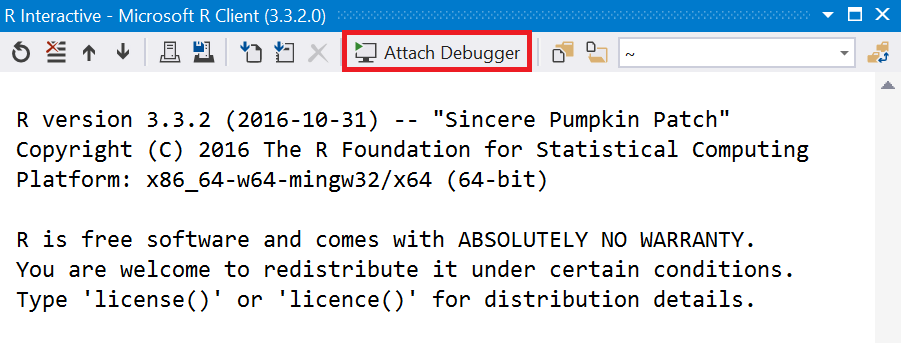

#Debugging with R Tools for Visual Studio

## Attach the debugger
If you’re an experienced Visual Studio user, you’ll find that the debugging experience is a bit different from what you may be used to. For example, if you’re writing a C# console application, you’re used to just pressing **F5** to launch your console application under control of the debugger.

In the R World, the experience is a bit different. (See note [1] below.)

First, you must attach the debugger to the R Runtime, using the R **Tools** | **Session** | **Attach Debugger** command. 

  

In your everyday work you should use the toolbar in R Interactive, as it saves you a number of mouse clicks / keystrokes:

  

## Set breakpoints
Next you need to set any breakpoints that you want to hit in the debugger. You need to tell R to run the code that you want to debug. This is called sourcing your file. This tells the R interpreter to run the code inside the file, and since you’ve attached a debugger to the R process, execution will stop at the first appropriate breakpoint.

For example, if the code that you want to debug is at global scope (i.e., not within a function) in a file called Tutorial.R, you would:

1. Attach the debugger to R (you’ll notice that Visual Studio will change your window layout to the debugger window layout).
2. Set a breakpoint in the file – in the example below, this is on line 3.
3. Source the file – you can do this via R Tools/Session/Source R Script command, or by typing **CTRL+R**, **CTRL+S** with the input focus set to the editor. (See note [1] below.)

  

All standard Visual Studio debugger commands work, with a few known limitations. You can:
* Set, Delete, and Deactivate Breakpoints
* Step Over (**F10**), Step Into (**F11**) and Step Out (**SHIFT-F11**) the current line
* Continue Execution (**F5**)
* Inspect local variables using the Locals Window
* Inspect arbitrary expressions (that are in scope) using Watch Windows
* Stop Debugging (**SHIFT-F5**)

After each debugger command, you’ll also see that you are stopped at the Environment Browser prompt in the R Interactive Window.  From there, you can also issue Environment Browser commands (e.g., n for next command, or c to continue execution). 

### Known Issues in the Debugger:

* Step Out (**F11**) will sometimes step out of the current block scope (e.g., within a for() loop) and not out of the current function. We are working on a fix for this for a subsequent release.
* Setting a breakpoint on the first line of a function declaration doesn’t work: line 1 the example below, so don’t do this:

`   f <- function(x) {`
      `print(x + 1)`
   `}`

* We are working on adding tool tips (hover over a variable to see a tooltip display the value of the variable) for a future release.
* The Browse prompt in the R Interactive Window is frequently out of date with respect to the actual state when debugging. This manifests itself when a debugging session runs to completion, but you still see a Browse> prompt in the R Interactive Window. We are working on a fix for this in a future release.
* If you are stopped on a breakpoint you may need to press **F10** multiple times to step over the line that contains the breakpoint. This is a known issue with R itself (you see similar behavior in RStudio), and we are working on a long term fix for this. You can simply turn off the breakpoint on that line and continue stepping without having to press F10 multiple times to get over that line.
* Editing the value of variables in a watch or locals window does not currently work. This will be fixed in a future release.

[1] R is different than C# because there isn’t a main() function to start debugging at. Furthermore, since there isn’t a compilation step either, you need to first tell RTVS what code you would like to debug. In this way, R is more like ASP.NET debugging, where you need to tell Visual Studio which page to start debugging at. In the Public Preview of RTVS, we’re looking to make the model more similar to the ASP.NET model to simplify things, and to allow you to return to F5-style debugging.

[2] Note that calling the standard source() function from the R Interactive Window will not work in this scenario. 

