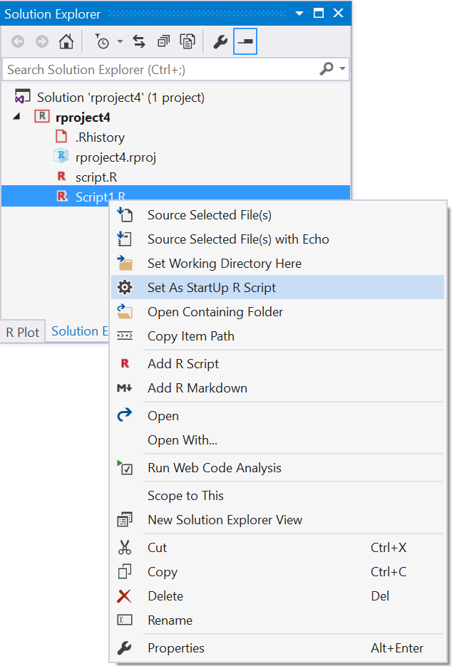
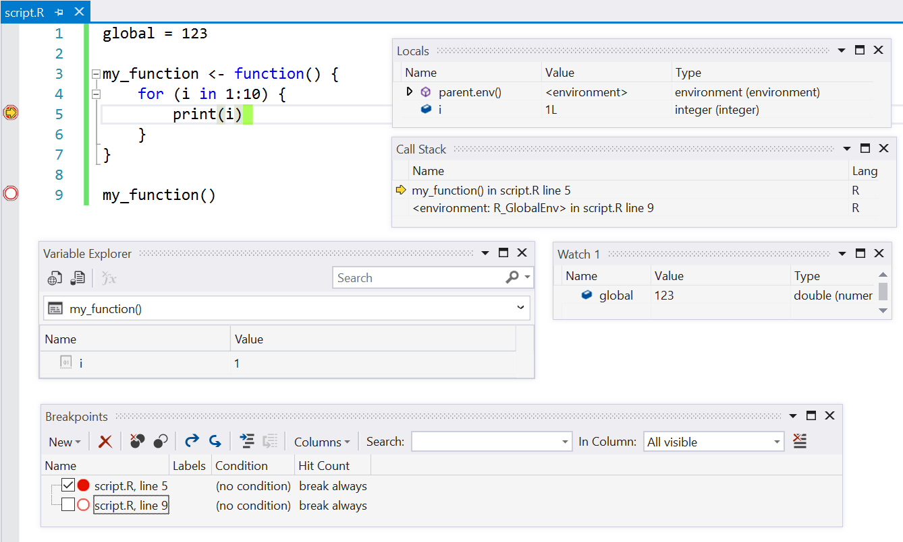

# Debugging with R Tools for Visual Studio

## Starting the debugger

There are two different ways to run code under the debugger: **launching** and
**attaching**.

To **launch** code under the debugger, you must first tell Visual Studio what
script to launch when you press F5. If you have created a new project using
Visual Studio, the file **Script.R**, which was automatically created for you,
is predefined as the startup script. If you want to launch a different script,
all you need to do is right-click on a script in Solution Explorer and run the
`Set As StartUp R Script` command:

You can set breakpoints in the startup script before you press F5 to launch the
debugger.

**Attaching** the debugger to the Interactive Window lets you debug code that
you are calling from the Interactive Window. This is especially useful when you
are testing a function, and calling it repeatedly with different parameter
values. There are two ways to attach a debugger to your Interactive Window
session:

1. Use the R Tools menu - there is an `Attach Debugger` command under the
Session menu:

2. In your everyday work you should use the toolbar in R Interactive, as it
saves you a number of mouse clicks / keystrokes:

It's important to note that if you attach a debugger to your session, you'll
first need to tell RTVS what code you would like to debug. You do so by running
the `source` command on the files that you want to debug. You can do this by either:

1. Right-clicking on the editor window containing the file you want to source
   and running the `Source R Script` command
1. Right-clicking on the file in Solution Explorer and running the `Source
   Selected File(s)` command

If you use F5 to start the debugger, RTVS will automatically source the StartUp
file on your behalf.

All standard Visual Studio debugger commands work, with a few limitations.

* Toggle Breakpoints (**F9**)
* Disable (**CTRL+F9**) Breakpoints
* Step Over (**F10**) the current line 
* Step Into (**F11**) the current line
* Continue Execution (**F5**)
* Stop Execution under Debugger (**SHIFT+F5**)
* Execute the StartUp file without using the Debugger (**CTRL+F5**)

Here's a screenshot that shows the many debugging windows and features available
to you:

* Inspect local variables using the Locals Window
* Inspect local variables using the Variable Explorer 
* See where you are in your program using the Call Stack Window
* Fine-grained controls over your breakpoints, including *disabling* (but not
  deleting) a breakpoint
* Inspect arbitrary expressions (that are in scope) using Watch Windows

After each debugger command, you'll also see that you are stopped at the
Environment Browser prompt in the R Interactive Window.  From there, you can
also issue Environment Browser commands (e.g., `n` for next command, or `c` to
continue execution).

## Visual Studio Data Tips

Visual Studio Data Tips let you hover over a variable that you want to inspect,
and then drill down into the objects within that variable. This lets you inspect
variables in-place, while stopped in the debugger, without having to resort to
using other windows like the locals window.

