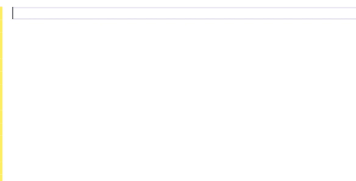
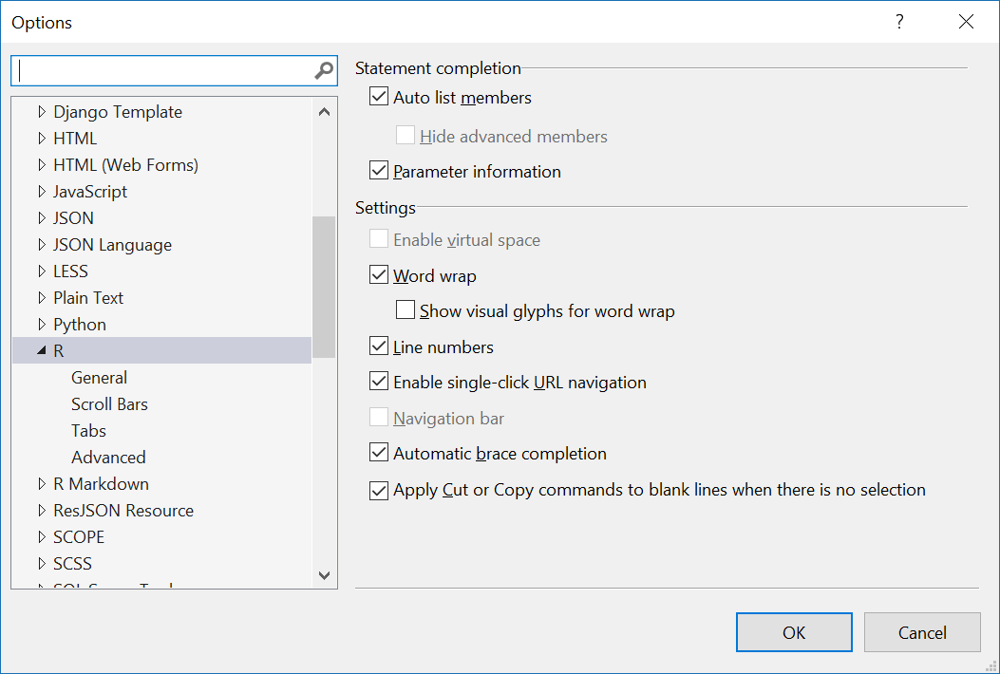

# Editing in R Tools for Visual Studio
 
The Visual Studio editor is a powerful editor that we have tailored for your
needs as an R user. This section walks you through some of the key features of
the editor. Since the editor is part of Visual Studio and *extensible*, you have
the full range of Visual Studio extensions available to you as well. For
example, if you prefer vim key bindings, you can install the [free VsVim
extension](https://visualstudiogallery.msdn.microsoft.com/59ca71b3-a4a3-46ca-8fe1-0e90e3f79329)
from the Visual Studio gallery.

## Typing and organizing your code

As you type your code, we do a number of things to improve your productivity.
For example, we will auto-complete braces and parenthesis as you type: 

When typing calls to functions that have many parameters, oftentimes you want to
line up the parameters to make the code easier to read. We now support
remembering the indentation position for your parameters once you've told us
what it is. From that point onwards we'll automatically indent to that
indentation position when you press ENTER at the end of a line:

Collapsible code regions are really useful when you want to temporarily hide
chunks of code in the editor. You just need to surround the code that you want
to create a region around using specially formatted comments. The start of a
region is defined by a comment with a trailing set of `---`; the comment text
will be displayed as the name of the region when the region is collapsed. The
end of a region is defined by a comment that contains `----`. See an example of
this below:

 
## Editor and Interactive Window

A very common style of programming involves write code in the editor, and then
selecting and sending lines to the R Interactive window (also known as a
Read-Eval-Print-Loop or REPL). You can select code within the editor and send to
the REPL using **CTRL-ENTER**:
 

 
If you press **CTRL-ENTER** in the editor without selecting any text, it will
send the current line that the cursor is on to the REPL, and then advance to the
next non-whitespace line. This makes it convenient to execute a sequence of code
from the editor simply by pressing **CTRL-ENTER** without the need to advance
the cursor to the next line. In the example below, the cursor was originally on
the line in the editor window with the "1", and **CTRL-ENTER** was pressed
twice. 
 
 
 
## Code Formatting

The editor supports automatically formatting R code based on your preferences.
For example, if you had a function definition all on a single line:
 

You can reformat the code by selecting it, right clicking on the selection, and
running the Format Selection command. Or you can also just type the shortcut key
chord **CTRL+K**, **CTRL+F**.
 
 
 
The editor also supports formatting an entire document. So if you loaded a large
document of R code that you wanted to format to your coding conventions, you can
open the file in the RTVS editor, and select Format Document from the Edit menu,
or by pressing the shortcut key chord **CTRL+K**, **CTRL+D**.
 
 
 
You can define your own R coding conventions by invoking Tools -> Options from
the Visual Studio main menu:
 
 

This brings up the Options dialog box. Once that is open, you can scroll down
until you reach the Text Editor node. Click the chevron to open it and scroll
down until you reach the R section. Here, you will find all of the editor
configuration settings for R. 
 
 
 
Another way to quickly get to the R editor options is to use the R Tools top
level menu:
 
 
 
Within the dialog box, if you select the **Advanced** options, you can define
how you want your code formatted:
 
  

This includes whether you want RTVS to automatically format code based on your
preferences when you type it, or whether you want it to reformat code that you
paste into RTVS from the clipboard. This is helpful when you are pasting in code
that you copy from a web browser, for example.
 
You can also undo formatting. If you have **Format** on paste enabled in the
RTVS options, and you want to preserve the formatting in the pasted code without
permanently turning off the **Format** on paste option in RTVS, all you need to
do is paste it into RTVS and press **CTRL+Z** to undo the formatting changes.
 
 