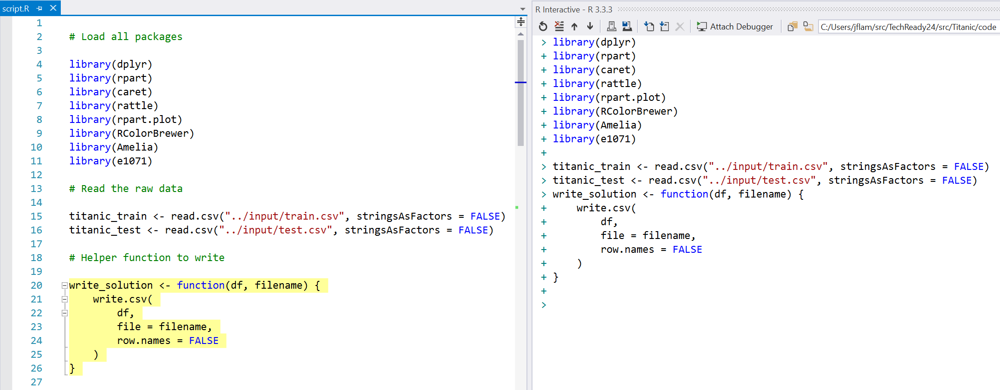
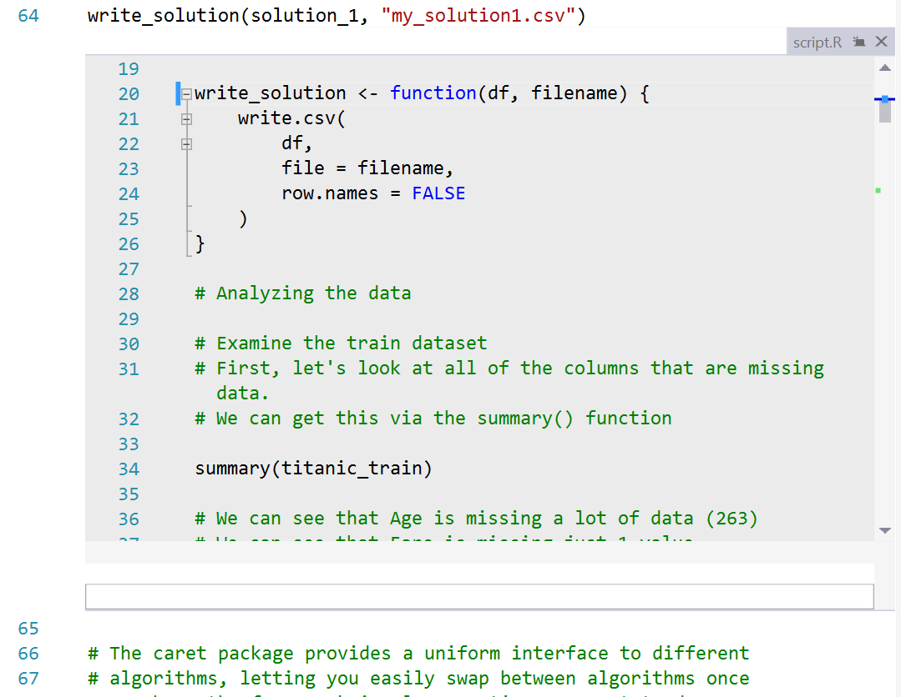
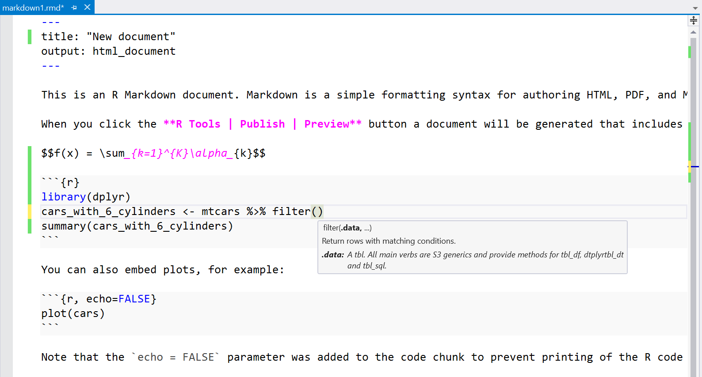
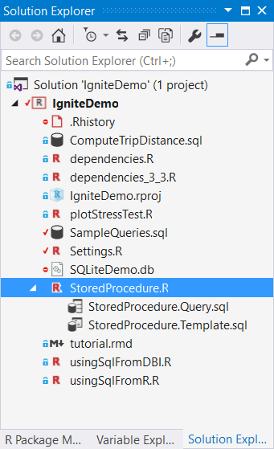
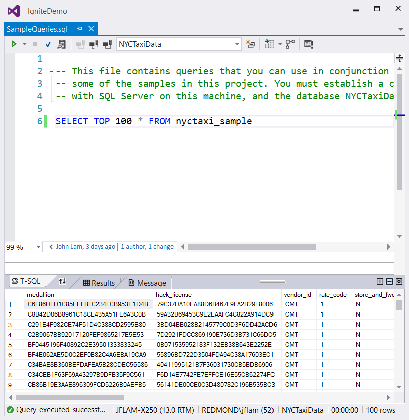
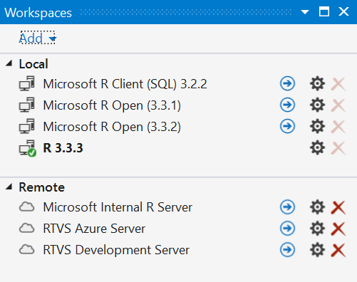

## Welcome to R Tools for Visual Studio 1.0!

## Installation and Getting Started

The pre-requisites for RTVS are: 

* Visual Studio 2015 Community, Professional or Enterprise
* Visual Studio 2015 Update 3
* An R interpreter: CRAN-R or Microsoft R Open
* Note that the [Visual Studio 2017](https://www.visualstudio.com/vs/whatsnew/)
  release of RTVS is not quite ready yet, but will ship soon.

You may have tools installed on your computer that ship with the _Visual Studio
Shell_, e.g., [Test
Professional](https://www.microsoft.com/en-us/download/details.aspx?id=48154)
and [SQL Management
Studio](https://docs.microsoft.com/en-us/sql/ssms/download-sql-server-management-studio-ssms).
The Visual Studio Shell lacks several components that are required by RTVS, so
we explicitly block the installation of RTVS if it detects the presence of the
Visual Studio Shell. You must install one of the supported versions of Visual
Studio before you install RTVS.

If you **already** have Visual Studio 2015 with Update 3 and R installed, you
can download and run the RTVS setup from the link below - but we highly
recommend following the [Installation guide](installation.html):

* [Download R Tools for Visual Studio](https://aka.ms/rtvs-current)

Once installed, create a project and code away!

* [How to start a new project in RTVS](start-project.html)

## Key features in Version 1.0

R Tools for Visual Studio 1.0 is our first release of tools for the R
programming language. This section gives you an overview of some of the key
features of the product, through the lens of _scenarios_. Below, you'll see
descriptions of key scenarios in the product, and an accompanying video that
walks you through the features that light up that scenario.

### Highly Productive Inner Loop

We spent countless hours designing and building a key set of features to improve
your _inner loop_ productivity. We think of your _inner loop_ as the set of
features that you use every minute of every day:

* Syntax highlighting
* IntelliSense
* Interactive code execution
* Code navigation
* Automatic formatting
* Extensions

**Syntax highlighting** makes it easy to distinguish between different token
types in your code. Strings, comments, and keywords are all visually distinct in
the editor. We even highlight and enable clickable hyperlinks in comments, to
make it easy to embed references in the comments to your R code. 

Visual Studio supports _themes_ which let you switch between a set of predefined
themes (e.g., Blue, Dark, and Light) as well as making it easy for you to define
custom colors for R syntax elements through Visual Studio's extensive
customization features.

**IntelliSense** puts information about functions that you can call, members of
objects, and [code snippets](code-snippets.html) you can insert directly in your
line of sight as you code. It displays possible completions as you type, and
completes when you press the TAB or ENTER keys.

 

**Interactive code execution** lets you execute and see the results of running
small pieces of code as you write it. We integrate the typing experience in the
editor with the Interactive Window. You type code into the editor window, and
press CTRL+ENTER to send the current line under the cursor to the Interactive
Window for execution. You can select several lines of code in the editor (see
the screenshot below), and press CTRL+ENTER to send the selection to the
Interactive Window for execution. Placing the editor window and the Interactive
Window side-by-side is a great way to experience this feature:

**Code navigation** gives you quick access to the source code of your program
and its libraries. You can quickly go to the definition of one of your functions
by pressing F12, or pop up an inline mini editor to read the source code of a
library function by pressing ALT+F12 (see below). This is a key feature to help
keep you in the flow of your work vs. being distracted by having to search for
and manually navigate to the code of interest.

**Automatic formatting** saves you time when documenting code or formatting it
the way you want it to be - even if you copy and pasted that code from a
different implementation. Here's an example of generating an
[Roxygen](http://roxygen.org/) comment using the parameter names of a function
simply by typing `###` on a blank line above the function definition:

**Extensions** for Visual Studio are provided by a rich ecosystem of 3rd party
developers. Here are some examples of popular Visual Studio extensions that you
can use to further improve your productivity while working with R. One of the most popular 

* [VsVim for vim key bindings](https://marketplace.visualstudio.com/items?itemName=JaredParMSFT.VsVim)
* [Github](https://marketplace.visualstudio.com/items?itemName=GitHub.GitHubExtensionforVisualStudio)
* [Markdown editor with live preview](https://marketplace.visualstudio.com/items?itemName=MadsKristensen.MarkdownEditor)

See the [Visual Studio Marketplace](https://marketplace.visualstudio.com/) to
find more extensions.

### Extensive debugging features

One of the key strengths of Visual Studio is its award-winning debugging UI.
RTVS builds on top of this strong foundation, and adds innovative new UI such as
the [Variable Explorer](./variable-explorer.html) and the Table Viewer. We'll
see how these key Visual Studio features will help you write better code,
faster:

* Breakpoints
* Watch windows
* Data Tips
* Variable explorer
* Interactive window

**Breakpoints** are key to the debugging experience. You can set standard
breakpoints, which break into the debugger every time, and press F5 to launch
the startup script under control of the Visual Studio debugger. 

**Watch windows** are windows that inspect variables. You can layout as many
watch windows as you want, and the values of the variables that you are
inspecting in those watch windows will update each time you break into the
debugger. 

If you want to interactively inspect variables while stopped at the debugger,
you can use Visual Studio's handy [Data
Tips](https://msdn.microsoft.com/en-us/library/ea46xwzd.aspx) feature. Just
hover over a variable using your mouse pointer, and you'll be able to inspect
the variable and even drill down into sub-objects interactively:

While Visual Studio has a powerful set of features for inspecting variables,
oftentimes R developers are using data structures such as data frames that
aren't easily visualized using the Visual Studio UI. To improve this experience,
we have created the [Variable Explorer](./variable-explorer.html) which lets you
interactively inspect data frames, and even export their contents to Excel. This
makes it easy to snapshot the state of a data frame between transformations to
better understand where things may have gone wrong in your computations:

Finally, the [Interactive Window](./interactive-repl.html) is a powerful tool
that lets you interactively call functions in your code. You can also have the
debugger bound to your Interactive Window session, which lets you step through
the code that you're calling. This makes it easy to call functions with
different parameter values to verify that the behavior of your function is
correct.

### Powerful data visualizers

While writing your R programs, you will frequently need to visualize your data.
Either through inspecting the values of your data or through plots, RTVS
provides you with the tools that you need to be highly productive in your day to
day work. Let's look at some of the powerful data visualization features in RTVS:

* Variable explorer
* Table viewer
* Excel integration
* Plot windows
* Window docking
* Multiple plot windows
* Plot history

The [Variable Explorer](./variable-explorer.html) gives you a convenient way to
see all of the variables that you have defined in your program, including data
frames:

It provides convenient links to other tools like the **Table viewer** for
visualizing your data frames, and a one-click experience for exporting your data
frame to **Excel**:

[Plots](./plotting.html) are a key part of your workflow as an R developer.
There are fantastic plotting libraries available for R, and we make it easy for
you to interact with the plots that they create. We give you tools to arrange
your plots where you want them to be, we give you with an interactive history of
all of the plots that you've created, and we make it easy to export your plots
to other tools so that you can generate reports from your data.

### Easily share your results with others

Sharing your results with others, easily, is a key design goal of RTVS. Your
colleauges prefer to consume their documents using a variety of different media: 
ranging from web pages to PDFs to Word documents. Your results often include
formatted text, plots and equations. 

**RMarkdown** gives you a way to easily [create
documents](http://rmarkdown.rstudio.com/) to share your results with your
colleagues. We take advantage of Visual Studio's high-performance editor to
deliver a lag-free typing experience in your RMarkdown documents. Our editor has
syntax coloring and IntelliSense, for both your Markdown markup **and the R code
within Markdown code blocks**:

We make it easy for you to generate HTML, PDF, or Word markdown documents. For
more details, see the [RMarkdown documentation](./rmarkdown.html).

### Better with SQL Server

A tremendous amount of enterprise data is stored in relational databases, and
[SQL Server](https://www.microsoft.com/en-us/sql-server/sql-server-2016) is one
of the most popular relational databases on the market. SQL Server 2016 has a
feature called [SQL Server R
Services](https://www.microsoft.com/en-us/sql-server/sql-server-r-services),
where we have embedded an R runtime in the database server. This makes it easy
to use R to perform advanced analytics over your relational data, and
dramatically reduces the latency required to perform those analytics by
eliminating the need for data movement.

This feature uses [SQL R Stored
Procedures](https://msdn.microsoft.com/en-us/library/mt591996.aspx) that mixes R
and SQL code together in a stored procedure. You'll need to write some SQL code
to select the data that your R code analyzes. Since you're writing code in two
different languages, we've added features in RTVS to write **and test** your SQL
code, and your R code _independently_. You begin by using our `SQL R Stored
Procedure` template in Visual Studio to create a new Stored Procedure. It
generates three files for you:

1. `StoredProcedure.R` is where you write the R code that you want to execute in
   your SQL stored procedure.
1. `StoredProcedure.Query.sql` is where you write the SQL code that you want to
   execute in your SQL stored procedure.
1. `StoredProcedure.Template.sql` is the generated template file that will
   combine your SQL query and your R code.

When you double click on the `StoredProcedure.Query.sql` file, we activate the SQL
editor, courtesy of the [SQL Server Data Tools for Visual Studio
extension](https://msdn.microsoft.com/en-us/mt186501.aspx) that gives you syntax
coloring and IntelliSense for your SQL code. 

Once you're happy with your SQL and your R Code, RTVS will handle combining your
results and packaging them up to send to SQL Server. For more details, see the
detailed walkthrough in our documentation for [SQL Server
support](./sqlserver.html).

### Scalable compute resources

R developers and data scientists often prefer to use laptops in their day-to-day
work. They develop their models against down-sampled datasets until they are
satisfied with the results that they can get from those datasets. When they want
to validate their models against larger datasets, they often have to move their
code or their development environments to a more powerful machine.

The [workspaces](./remote-execution.html) feature of RTVS makes it easy to bind
RTVS to different workspaces. Local workspaces are simply other versions of the
R interpreter that you have on your local computer. **Remote workspaces** are R
interpreters that are installed on remote computers. By [installing RTVS Remote
Services](./setup-remote.html) on a machine with lots of CPU cores, lots of RAM,
lots of storage, or lots of GPU, you can tailor the execution environment to the
needs of your code and the data that you want to analyze. A remote workspace can
be shared by several team members, making it easier to collaborate on large or
sensitive datasets that must reside on an IT-managed computer.

You can even setup your remote workspaces on [Azure virtual
machines](https://azure.microsoft.com/en-us/services/virtual-machines/?b=17.08),
eliminating the need for capital expenditures to get the computing resources
that you need to get your work done. 

When you are using a remote workspace, all editing and visualization are done
using RTVS on your local computer. All code execution occurs on the remote
computer. This ensures that the computing resources on your remote computer are
totally dedicated to running your R code, without the overhead of running an IDE. 

For more details, see the [workspaces documentation](./remote-execution.html).

### Table of contents for the documentation

* [Editor](editing.html)
* [IntelliSense](intellisense.html)
* [Code Navigation](code-navigation.html)
* [Code Snippets](code-snippets.html)
* [R Interactive Window](interactive-repl.html)
* [History window](history.html)
* [Variable Explorer](variable-explorer.html)
* [Plotting](plotting.html)
* [Debugging](debugging.html)
* [Workspaces and remote execution](remote-execution.html)
* [Help](help.html)
* [SQL tooling](sqlserver.html)
* [R Markdown](rmarkdown.html)
* [Git](git.html)
* [Extensions](extensions.html)
* [Polyglot IDE](polyglot.html)

## Send us your feedback!

We have three different ways you can send feedback to the team:

1. **Via Github**: This is the preferred way to send us feedback. You can use
   [this link](https://github.com/Microsoft/RTVS/issues), or the built-in
   shortcut in the RTools -> Feedback menu.

1. **Send a Smile / Frown**: This is a quick way to send feedback **and** attach
RTVS log files to assist in the diagnosis of your issue. You can find this
command under the R Tools -> Feedback menu. This command will collect logs,
start your mail client and attach the log file. You have the opportunity to
examine the contents of those files before you click Send. The logs are written
into `%TEMP%/RTVSlogs.zip` in case you want to send it yourself.

Note that the above logging functionality will not be available if you have
explicitly opted out of Visual Studio telemetry through the Help -> Feedback ->
Settings menu command, or during installation.

1. **Via email**: You can send direct feedback to the team at
[rtvsuserfeedback@microsoft.com](mailto:rtvsuserfeedback@microsoft.com).

## Frequently Asked Questions

**Q. Is RTVS free?**

A. Yes! RTVS when combined with free Visual Studio Community Edition is a
complete and perpetually free IDE. Please make sure that you [read the software
license terms to see if you qualify for using the free edition of Visual Studio
Community Edition](https://www.visualstudio.com/support/legal/mt171547).

**Q. Is RTVS Open Source?**

A. Yes! The source code for RTVS is [available on
Github](https://github.com/microsoft/RTVS) and is released under the terms of
the MIT license. There is a second component of RTVS, called RHost, which links
to the R Interpreter binaries. Its source code is also [available on
Github](https://github.com/microsoft/R-Host) and is released under the terms of
the GNU Public License V2.

**Q. What versions of Visual Studio does RTVS run on?**

A. Visual Studio 2015 Update 3 and higher. Community, Pro, and Enterprise
Editions. Visual Studio 2017 support will be released shortly.

**Q. Does RTVS work with Visual Studio Express editions?**

A. No.

**Q. What R interpreters does RTVS work with?**

A. [CRAN R](https://cran.r-project.org/), [Microsoft R Client and Microsoft R
Server](https://msdn.microsoft.com/en-us/microsoft-r/)

**Q. Where can I download these interpreters?**

A. See the [installation instructions](installation.html).

**Q. Since RTVS is in VS, does it mean that R can be easily used with C#, C++
and other Microsoft languages?**

A. No. RTVS is a tool for developing R code, and uses the standard native R
interpreters. We do not have any support currently for interop between R and
other languages.

**Q. Feature X is missing, but RStudio has it!**

A. RStudio is a fantastic and mature IDE for R that's been under development for
many years. We hope to have all the critical features that you need to be
successful. Please help us prioritize the TODO list by taking the [RTVS
survey](https://www.surveymonkey.com/r/RTVS1).

**Q. Will RTVS work on MacOS / Linux?**

A. No. RTVS is built on top of Visual Studio, which is a Windows-only
implementation. However, we are investigating building a new set of tools based
on [Visual Studio Code](https://code.visualstudio.com/), the wildly popular
cross-platform editor from Microsoft.

**Q. Can I contribute to RTVS?**

A. Absolutely! The source code lives on
[Github](https://github.com/microsoft/RTVS). Please use our issue tracker to
submit / vote / comment on bugs!

**Q. Does RTVS work with my source control system?**

A. Yes, you can use any source control system that is integrated into Visual
Studio. e.g., TFS, git, SVN, hg etc.

**Q. I don't use a US English locale in Windows or in VS. Will RTVS work?**

A. The 1.0 release of RTVS will be English-only. The 1.1 release will be
localized to the same set of languages that Visual Studio itself is. In the
meantime, we recommend using the English language pack for Visual Studio. If
English is not available in the drop-down, you'll need to install the [Visual
Studio Language
pack](https://www.microsoft.com/en-us/download/details.aspx?id=48157).

**Q. Will RTVS work with 32-bit editions of R?**

A. No. RTVS only supports 64-bit editions of R running on 64-bit editions of
Windows.

**Q. I really like my current Visual Studio settings, but I want to try out the
new Data Science settings. What should I do?**

A. You can always save your current Visual Studio settings through Tools ->
Import and Export Settings... command. You can also use this command to restore
one of the default Visual Studio settings (e.g., C++ or General).

**Q. What are the recommended `.gitignore` settings for an RTVS project?**

A. Github maintains a master repository of recommended `.gitignore` files. You
can see it here: [R
.gitignore](https://github.com/github/gitignore/blob/master/R.gitignore)

**Q. Can I store my Visual Studio project on a network share?**

A. No. This is not a supported scenario for Visual Studio.

## Contributing to the docs and samples

If you're interested in contributing to the docs or samples, feel free to clone
the repository and submit a pull request. More instructions can be found in our
[contribution guide](contributing-docs.html).
