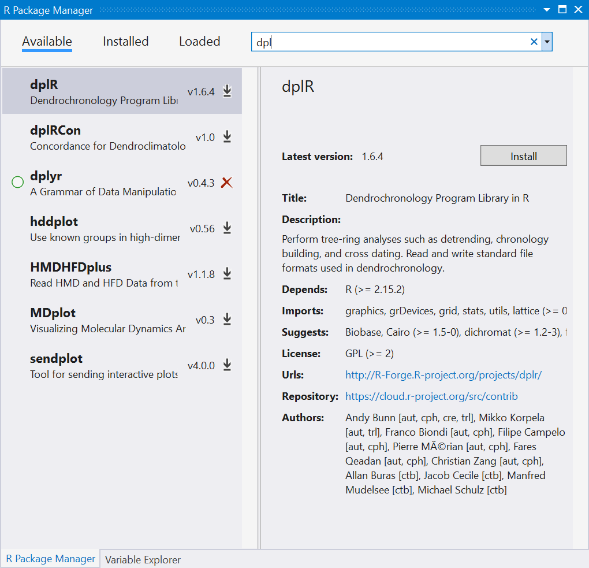

Thanks for downloading the 0.3 release of RTVS!

There are a number of new features in 0.3 that we would like you to try out and
give us feedback on, in addition to numerous bug fixes.

## Package Manager

The Package Manager is a UI for working with packages. It has three tabs, which
lety you browse, install, and visualize the list of loaded packages in your R
session.

TODO: discussion of where the package manager looks for packages and how to
configure this.

### Installed Packages 

The default tab is the Installed Packages tab, which provides a list of all installed and
loaded packages. If there is a a green dot next to a package, it indicates that
the package is also loaded into your R session. 

Installed packages can also be uninstalled by clicking on the red "x" to the
right of each listed package. The presence of a blue up arrow to the right of
each installed package indicates that there is a newer version of your currently
installed package. You can click on that arrow to download that package.

### Available Packages

The Available Packages tab lets you browse and search for packages. You can use
the search box in the top-right corner to filter the list of available packages
by name. When you select a package, the right hand pane provides you with some
summary information about the package, along with hyperlinks to let you read
more about the package before installing it.

### Loaded Packages

The Loaded Packages tab lets you examine all of the packages loaded into your R
session. All of the packages on this tab should have a green dot next to them
which indicates that they are loaded. You can also see details about the package
along with the path to where the package is installed on your machine.

## Editor
-	IntelliSense and parameter help for user-defined functions (single file)
-	Completion for function arguments and variables declared in the file
-	Code snippets (type if[tab][tab] or seq[tab][tab]), supports Insert Snippet… and Surround With…
-	GoTo Definition 
-	Peek Definition
-	Insert Roxygen comment block (via context menu or type ###)
-	Reworked smart indentation, now support aligning function arguments
-	Correct word selection via double-click or Shift-Arrow or Ctrl+F3

## Debugger
-	Data tooltip when you hover over variable in the editor
-	Cleaned up call stack display

## Variable Explorer
-	Allows opening data frames and vectors in Excel
-	Displays information on functions in packages
-	Supports stack frames during debugging

## IDE
-	Dedicated R Toolbar simplifying publishing and running Shiny apps
-	Data Science popular keyboard shortcuts are now default
-	Context menu in the project system with convenient commands
-	Files and projects can be opened via Open With… in Windows Explorer
-	Improved command shortcut availability in various contexts
