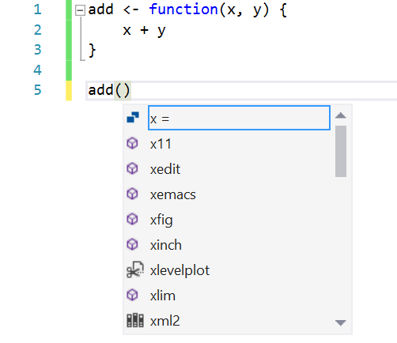
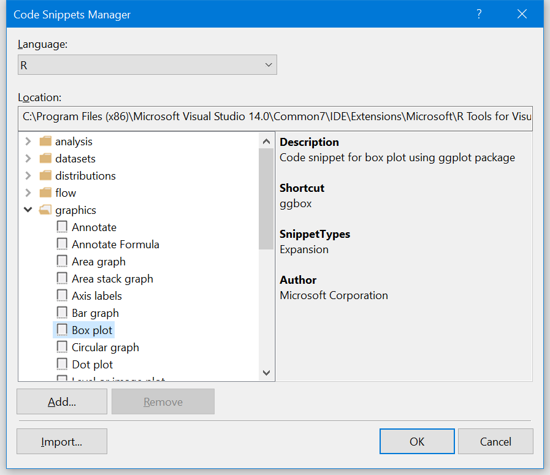

## Thanks for downloading the 0.3 release of RTVS! (April, 2016)

There are a number of new features in 0.3 that we would like you to try out and
give us feedback on, in addition to numerous bug fixes.

## Package Manager

The Package Manager is a UI for working with packages. It has three tabs, which
let you browse, install, and visualize the list of loaded packages in your R
session.

### Installed Packages 

The default tab is the Installed Packages tab, which provides a list of all installed and
loaded packages. If there is a green dot next to a package, it indicates that
the package is also loaded into your R session. 

Installed packages can also be uninstalled by clicking on the red "x" to the
right of each listed package. The presence of a blue up arrow to the right of
each installed package indicates that there is a newer version of your currently
installed package. You can click on that arrow to download that package.

### Available Packages

The Available Packages tab lets you browse and search for packages. You can use
the search box in the top-right corner to filter the list of available packages
by name. When you select a package, the right hand pane provides you with some
summary information about the package, along with hyperlinks to let you read
more about the package before installing it.

### Loaded Packages

The Loaded Packages tab lets you examine all of the packages loaded into your R
session. All of the packages on this tab should have a green dot next to them
which indicates that they are loaded. You can also see details about the package
along with the path to where the package is installed on your machine.

## Editor

We have made a lot of new improvements to the editor in this release.

### IntelliSense improvements

The editor now supports IntelliSense for user-defined functions in the same
file:

IntelliSense also assists in named parameter completion for functions defined in
the same file:

This also works for variables defined in the file:

### Code Snippets

Perhaps the biggest everyday productivity boost that you'll get in Preview 0.3
is Code Snippets. These are pieces of code that expand when you type the code
snippet (which appears in the IntelliSense list) and press TAB. 

Some simple examples:

- type =TAB and VS expands to the <- assignment operator.
- type >TAB and VS expands to the %>% pipe operator

If you want to examine the Code Snippets in Visual Studio, use the Tools/Code
Snippets Manager menu to bring up the UI. Select R from the list of languages in
the drop-down to see all of the snippets that we've defined for R.

Snippets can be much more than just completion of characters. They can save you
from having to remember the names of parameters in complex function calls.
Here's an example of a snippet for reading a CSV file via the `read.csv`
function:

You can create your own Code Snippets as well; this is well-documented in [this
MSDN article](https://msdn.microsoft.com/en-us/library/ms165394.aspx).

A code snippet is just an XML file; here's the Code Snippet for the pipe
operator:

### Code Navigation

You can now navigate to the definition of another function within the same file
using the GoTo Definition command from the context menu, or by placing your
cursor over a call to the function and pressing F12. Note that this feature only
works today within the same file; send us feedback if you feel multi-file
navigation is an important feature and we will prioritize and add to a future
release.

If you would prefer instead to _peek_ at the definition of a function, you can
do so by using the Peek Definition command from the context menu, or by placing
your cursor over a call to the function and pressing ALT+F12:

### Code formatting

We have added a few additional features to make it easier to format / select
your code. 

You can insert a Roxygen comment block by typing ### at the start of a line:

Auto-formatting of parameters lets you align based on function arguments:

We have also fixed the behavior of double-click to correctly select words within
the editor.

## Debugger

We have now enabled tooltips in the debugger. This lets you hover over a
variable that you want to inspect, and then drill down into the objects within
that variable. This lets you inspect arbitrary variables in-place while stopped
in the debugger without having to resort to using other windows like the locals
window.

## Variable Explorer

The variable explorer also has numerous improvements in this release. While the
data table viewer is a great tool, sometimes you want to be able to take your
data frame and *export* it to Excel. We've made it easy to do that in this
release by adding a small Excel icon to the variable explorer:

When you click on it, it will take your data frame and export it to a new Excel
Workbook:

-	Displays information on functions in packages
-	Supports stack frames during debugging

## IDE

-	Dedicated R Toolbar simplifying publishing and running Shiny apps
-	Data Science popular keyboard shortcuts are now default
-	Context menu in the project system with convenient commands
-	Files and projects can be opened via Open With… in Windows Explorer
-	Improved command shortcut availability in various contexts
