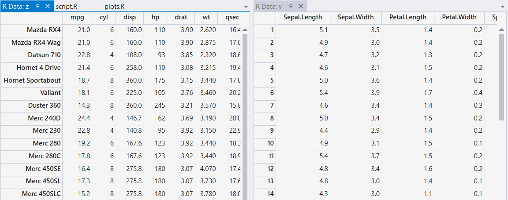

## What's new in R Tools for Visual Studio 0.4 (June, 2016 release)

There are new features in 0.3 that we would like you to try out and give us
feedback on, in addition to numerous bug fixes. This page summarizes what's new.

[Download RTVS 0.4 now](https://aka.ms/rtvs-current)

## Microsoft R Client Integration with RTVS

Microsoft R Client is [Microsoft's enhanced distribution of the R
programming
language](https://msdn.microsoft.com/en-us/microsoft-r/install-r-client-windows).
In 0.4, we have made it even easier for you to download and get started with
Microsoft R Client.

* If you don't have any R Interpreter installed on your computer, RTVS will
    offer to install Microsoft R Client the first time you run RTVS.
* If you want to install Microsoft R Client, we have also included a menu
    command that will download and install it.
* If you have just installed Microsoft R Client, we will ask you once, the next
    time you start RTVS, to switch to Microsoft R Client.
* If you want to installed Microsoft R Client and want to switch your active R
    installation to it, we have added a menu command to make it easier.

## Variable Explorer and the Data Table Viewer

We have made a number of key improvements to Variable Explorer. If you want to
search for an observation in a data frame, we now have an incremental search
over all observations in a dataframe. Note that you must first expand the data
frame in Variable Explorer for this to work. 

We support viewing variables defined inside of private named scopes as well. For
example, here are the variables defined in the Shiny package:

New in 0.4, we now let you view multiple data frames simultaneously in tabs, or
side-by-side:

