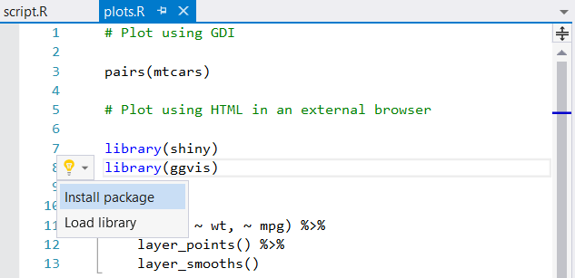
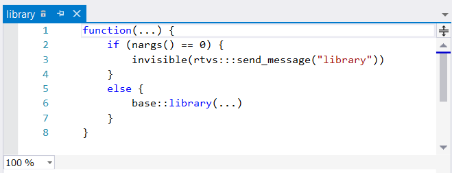
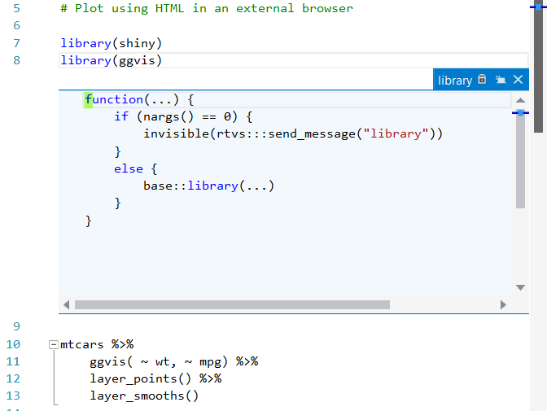
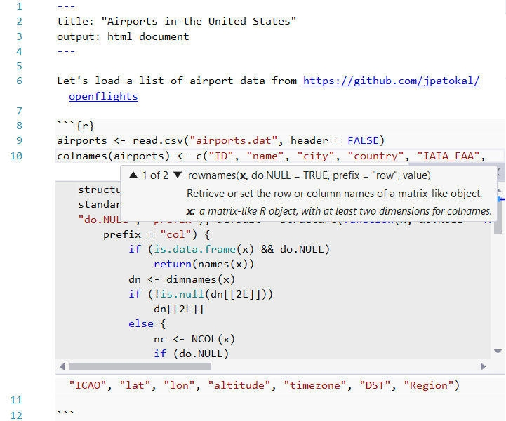
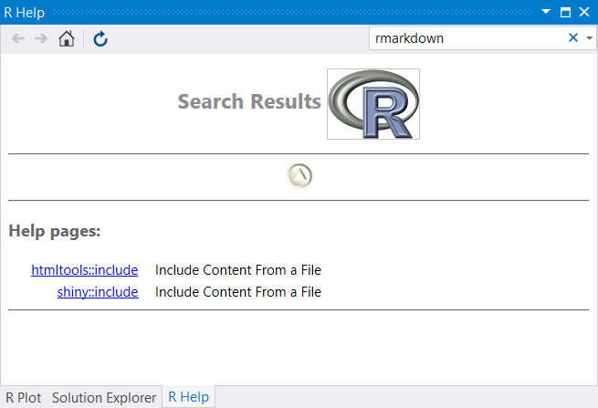
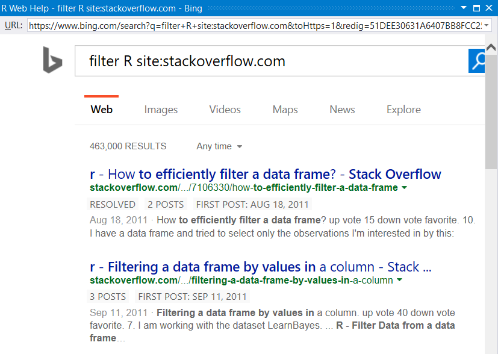
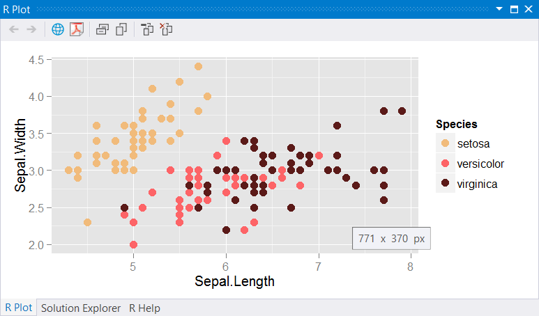
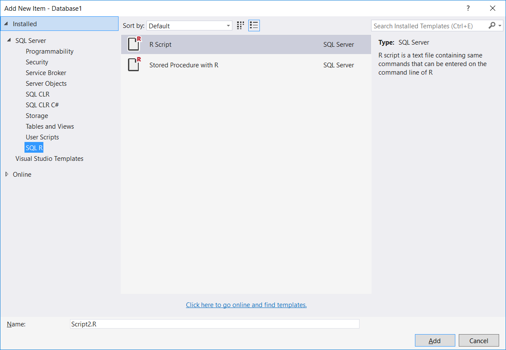
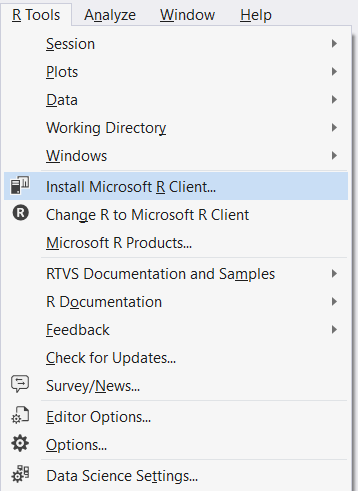

## What's new in R Tools for Visual Studio 0.4 (June, 2016 release)

Thank you for trying out R Tools for Visual Studio (RTVS) 0.4!

We've been listening to your feedback, and we've fixed many of the issues that
you have reported in 0.3. Thanks for your feedback, and please take a look at
[our Github Issues tracker](https://github.com/Microsoft/RTVS/issues?utf8=%E2%9C%93&q=is%3Aclosed+milestone%3A%22Preview+0.4%22) 
for a complete list of all of the bugs that we have fixed, as well as for a
detailed list of all of the new features in this release.

The rest of this document takes you on a tour of the new features in 0.4. Please
try them out and let us know what you think!

[Download RTVS 0.4 now NOTE this will only be live at 0.4 public launch](http://)

## Variable Explorer and the Data Table Viewer

You can now view multiple data frames in separate Data Table Viewer tabs. Using
Visual Studio's window layout features, you can drag the tabs to arrange them
side-by-side as well:

If you want to search for an observation in a data frame, we now have an
incremental search over all observations in a data frame. Note that you must
first expand the data frame in Variable Explorer for this to work. 

You can now sort columns in the Data Table Viewer. Clicking on a column header
will toggle through ascending, and descending sort order for that column. If you
hold down the SHIFT key while clicking on column headers, you can define multiple
sort orders as well based on the order in which you click the column headers.

We support viewing variables defined inside of private named scopes as well
(i.e., variables defined within a package). For example, here are the variables
defined in the Shiny package:

You can now delete variables from your R session directly from the variable
explorer. Just right click on the variable that you want to remove from your R
session and select the Delete command. Or you can just select the variable that
you want to remove and press the DELETE key.

## Editor Improvements

Light bulbs are suggestions that Visual Studio provides for commonly executed
actions. We have added support for installing and loading libraries in 0.4. If
you hover over a line that contains a `library` statement in the editor, we will
display a light bulb to the left of that line. Clicking on that light bulb will
reveal a couple of options, in this case either installing the package or
loading it:

Go-to-definition and peek are two commonly used features of the Visual Studio
editor. In 0.4, we have added the ability to open _library_ functions; in
previous versions we only supported the ability to open _user-defined_
functions. 

Go-to-definition is invoked by pressing F12 when the caret is positioned within
the name of a function. RTVS will open up a new editor window with the source of
the function displayed within it. Below is an example of examining the source
code for the `library` function.

Peek is an inline version of go-to-definition. Instead of opening up the
function in a separate window, an inline window is opened up within the editor
to show the source code for the function below where the function was
referenced. You invoke peek by pressing ALT+F12 when the caret is positioned
within the name of a function. Here's an example where the source code for the
`library` function is shown:

Collapsible code regions are really useful when you want to temporarily hide
chunks of code in the editor. You just need to surround the code that you want
to create a region around using specially formatted comments. The start of a
region is defined by a comment with a trailing set of `---`; the comment text
will be displayed as the name of the region when the region is collapsed. The
end of a region is defined by a comment that contains `----`. See an example of
this below:

## RMarkdown improvements

If you're a frequent creator of RMarkdown documents, you'll really appreciate
our full support for all R editor features within an R code block. Below, you'll
see that we have IntelliSense and the function peek feature displayed within an
R Markdown R code block:

We have also added support for generating PDFs from within RTVS now. All you
have to do is ensure that you've installed the [Miktex](http://miktex.org/)
library in addition to [Pandoc](http://pandoc.org/) and
[RMarkdown](http://rmarkdown.rstudio.com/).

## Help system improvements

You've always had the option of running the help system inside of a Visual
Studio tool window, or by launching the help in the default browser for your
computer. If you are using the tool window option (which is the default), you
now have the ability to type search terms into a separate search input field:

Lots of us run into problems writing our code and turn to the Internet for help.
We've streamlined this a bit further by incorporating keyword search directly
into RTVS. For example, if you were trying to figure out how to use the dplyr
`filter` function in the following code, all you need to do is place your caret
on the filter function call, and press F1.

This will bring up search results in a separate tool window. 

By default we scope the search to Stack Overflow, but you can configure it to
search with an arbitrary search clause in the Options dialog for RTVS:

## Streamlining the experience

To give you an improved experience with auto-formatting and single line
statements (e.g., for loops on a single line), we've changed the behavior of
auto-formatting to respect your wishes here. Here's how it looks like today:

When typing calls to functions that have many parameters, oftentimes you want to
line up the parameters to make the code easier to read. We now support
remembering the indentation position for your parameters once you've told us
what it is. From that point onwards we'll automatically indent to that
indentation position when you press ENTER at the end of a line:

It's pretty common to switch your working directory while working in an
interactive R session. We've now made it even easier to switch your working
directory by adding some additional commands:

1. You can switch the current working directory to the directory that contains
   the current file that you're editing. CTRL+SHIFT+E runs this command.

1. You can switch the current working directory to the directory that contains
   the root of the RTVS project. CTRL+SHIFT+P runs this command.

There are two new toolbar icons within the R Interactive Window that are also
run these commands for folks who are like to use the mouse:

Code snippets now work in both the editor and the R Interactive Window. Below,
I'm typing = and then pressing TAB to perform the completion.

## Plotting

We have made some improvements to plotting. First, we support global Windows DPI
settings, so for customers who are using high DPI monitors, we will respect the
Windows DPI settings when rendering plots so that they aren't disproportionately
sized with respect to the rest of the Visual Studio UI. Second, we also let you
quickly see the size of the plot area in vertical and horizontal pixels by
hovering your mouse over the image. Here's what that looks like:

Finally, we've added support for the
[locator](http://www.inside-r.org/r-doc/graphics/locator) API in our plotting
window, so that R code that interacts with the user clicking on plots will now
work inside of RTVS.

## SQL Support

In this release, we've added the beginnings of R support for SQL Server. We now
let you embed R script files within SQL Database Projects. This feature gives
you the full editing experience for R source files within a SQL Database
project. You can add both R files as well as a template file that can be used to
define a stored procedure that contains a call to the
`sp_execute_external_script` system stored procedure to execute arbitrary R
code.

This is what the editing experience looks like in a SQL Database Project. Note
that all of the RTVS windows (e.g., R Interactive Window and the Plotting
window) are available within the SQL Database project.

## Microsoft R Client Integration with RTVS

Microsoft R Client is [Microsoft's enhanced distribution of the R
programming
language](https://msdn.microsoft.com/en-us/microsoft-r/install-r-client-windows).
In 0.4, we have made it even easier for you to download and get started with
Microsoft R Client.

* If you don't have any R Interpreter installed on your computer, RTVS will
    offer to install Microsoft R Client the first time you run RTVS.
* If you want to install Microsoft R Client, we have also included a menu
    command that will download and install it.
* If you have just installed Microsoft R Client, we will ask you once, the next
    time you start RTVS, to switch to Microsoft R Client.
* If you want to installed Microsoft R Client and want to switch your active R
    installation to it, we have added a menu command to make it easier.

## Let us know what you think!

As always, please feel free to send us feedback using our Send a Smile (we like
these!) or Send a Frown feature. This document gives you a feel for the
_highlights_ of the new features in 0.4. However, we have closed 205 Github
Issues since the last release. Feel free to take a closer look using this
[Github Issues
query](https://github.com/Microsoft/RTVS/issues?utf8=%E2%9C%93&q=is%3Aclosed+milestone%3A%22Preview+0.4%22).
