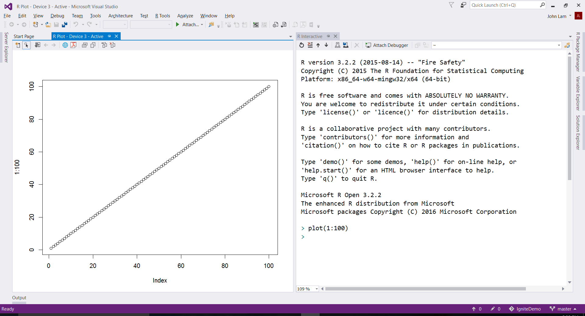
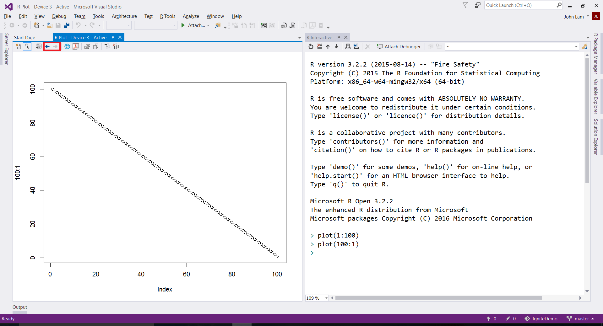
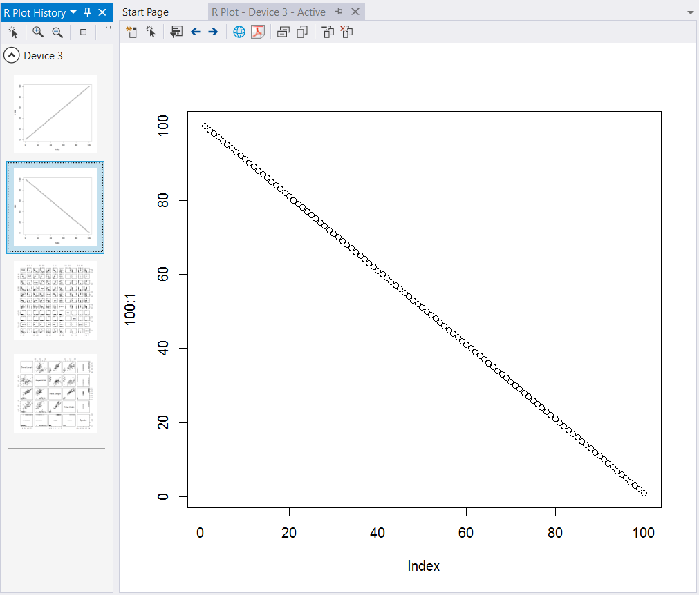
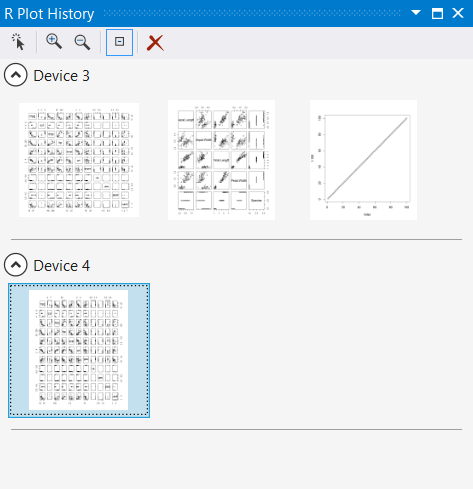
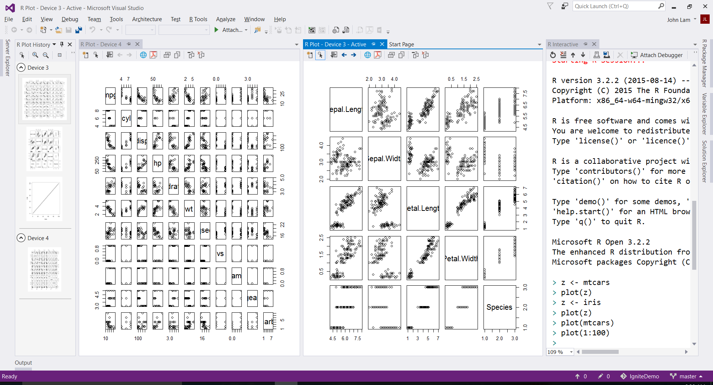
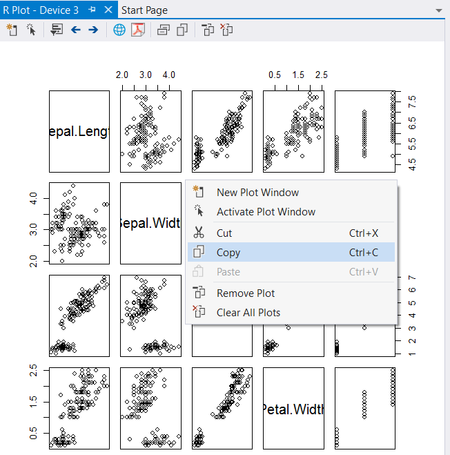

# Plotting

Plotting is a key part of the inner loop of the workflow for a data scientist.
In RTVS, all plotting activity centers around one or more plot windows, and
we've designed a number of features to improve your productivity in this key
activity.

This page contains the documentation for the plotting features of RTVS. Below is
a quick video overview of the plotting features:

<iframe width="560" height="315" src="https://www.youtube.com/embed/ZTbKmz5RSgY" frameborder="0" allowfullscreen></iframe>

## The Plot Window

A plot window holds a series of plots. Each plot is generated by a plot command.
Here's a simple example that plots a series of plots at (1,1), (2,2) ...
(100,100):

`> plot(1:100)`

When the command runs, it creates a new R Plot window if one wasn't created
already. 

If there was already a plot window, it will add the new plot to the
series of plots in that existing plot window. For example, if you now execute
the following command, you will now see a new plot replace the existing plot in the window:
 
`> plot(100:1)`

## The Plot History

When you run a new plot command, RTVS adds that command to your plot history.
This ensures that all of your previous plots within a session are preserved.
You can use the back and forward arrows (outlined in red) in the plot window
toolbar to navigate the set of plots that were plotted in that window.

You can also click on the toolbar button to show the Plot History Window. This
gives you a list of thumbnails of the plots in your session to help you quickly
navigate back to a plot that you were interested in.

The Plot History window can also be resized. When you resize the window, it will
show as many plots horizontally as will fit. You can also see that plots are
grouped by Plot History window as well, which is helpful when you start creating
more than one Plot Window (see the section on Multiple Plot Windows below).

The lifetime of your plot history is bound to the lifetime of your interactive R
session. If you reset your R session, or exit and restart Visual Studio, your
plot history will be reset.

You can also _edit_ your plot history. You can remove the current plot from the
plot window (and its history) by clicking on the toolbar icon to remove the
plot. You can also right-click on any plot in the plot history and run the
Remove Plot command to remove it from the plot window's history. This lets you
quickly remove a plot from the history without needing to re-render it in the
main plot window first. 

## Resizing and docking plot windows

Since the plot window is a Visual Studio tool window, it supports all of the
[standard tool window
operations](https://msdn.microsoft.com/en-us/library/4k7zyeba.aspx). One example
is tearing off the plot window into its own top level window:

 
You can dock it into different windows within Visual Studio:

 
You can drag the plot window onto a separate monitor as well, and even save the
layout of your windows into custom named layouts. You can read more about how to
do this in the custom layouts section of this article on [customizing window
layouts in Visual
Studio](https://msdn.microsoft.com/en-us/library/4k7zyeba.aspx).

The plot window will resize the contained plot as the window is resized. This is
possible because the plot window retains the command and the data that was
used to render the plot. This lets RTVS render the highest quality
representation of the plot as you resize the window. 

## Exporting Plots

Plots can also be exported in a number of different formats. You can use the
toolbar buttons in the plot window to copy the current plot to the clipboard as
a bitmap, or as a Windows metafile. The latter is the standard Windows vector
graphics format, which lets you resize a plot to an arbitrary number of pixels
without any loss of fidelity. You can use the toolbar buttons in the plot window
to save a copy of the plot as a bitmap, or as a PDF (Portable Document Format)
to a file. 

## Multiple Plot Windows

A key feature of RTVS is letting you create as many plot windows as you need to
do your work effectively. Oftentimes while doing analysis, you would like to
have several plot windows visible simultaneously. 

You can easily create a new plot window using the New Plot Window button in the
plot window toolbar. Once you've created a new plot window, you can make it the
_active_ plot window by clicking on the Activate Plot Window command on its
toolbar. Once active, all subsequent plot commands will render inside of that
plot window. At any point in time, you can choose to make another plot window
the active plot window by clicking on the Activate Plot Window command on its
toolbar.

You can also move plots _between_ plot windows. Simply right click on a plot
that you want to copy or move, and select Cut (if you want to move the plot) or
Copy (if you want to copy the plot). Then right click on the plot window that
you want to copy or move that plot to and select Paste.

Since plot windows are Visual Studio tool windows, you can use all of the
sophisticated [window layout
features](https://msdn.microsoft.com/en-us/library/4k7zyeba.aspx) in Visual
Studio to arrange your plot windows to suit your needs.

## Programmatically Manipulating Plot Windows

You can programmatically manipulate plot windows from your own R scripts. R plot
commands render their output to an R graphics device; a plot window renders the
contents of an R graphics device. Graphics devices are named, and their name is
shown in the title of each plot window. Knowing all of this, you can now
understand how the following commands are used to implement all of the plot
window functionality that you have already seen in RTVS:

You can list all of the graphics devices within the current R session:

`> dev.list()`

You can create a new graphics device:

`> dev.new()`

You can set the active graphics device to one of the ones on the list:

`> dev.set(3)`

Finally, you can delete the active device:

`> dev.off()`

