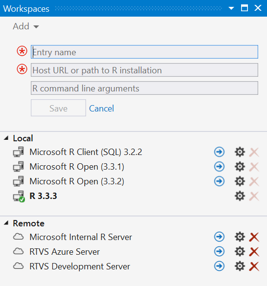
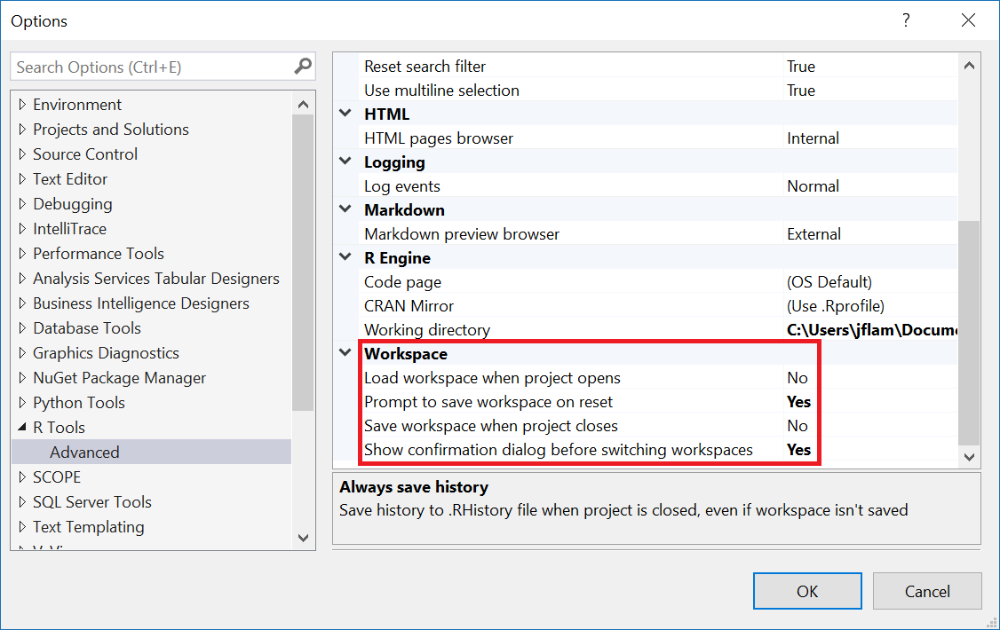
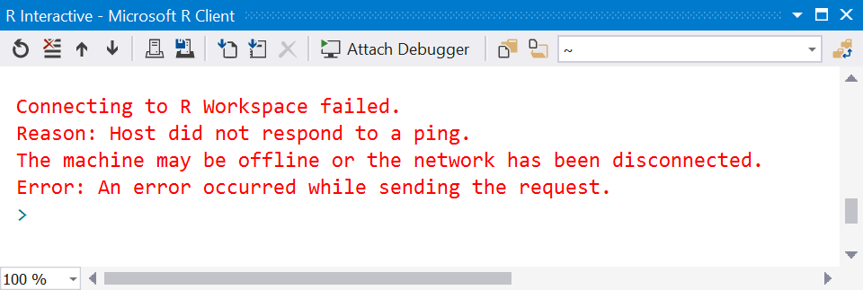
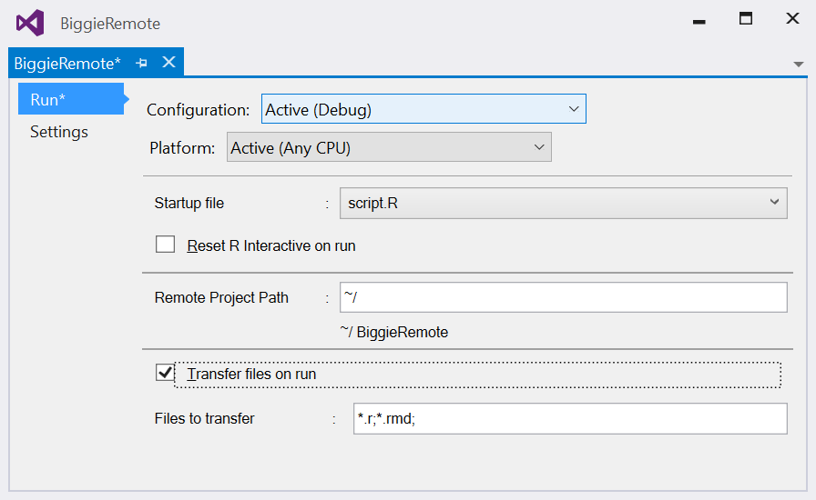

## Workspaces

Workspaces is a feature in RTVS that lets you control _where_ your R code runs.
The Workspaces tool window lets you choose between two types of places where
your code can run: Local and Remote. 

### Local Workspaces

Local workspaces shows you the set of all R interpreters that you have installed
on your computer. Local workspaces are auto-detected by RTVS when you launch
Visual Studio, or you can add your own local workspaces manually if you have
installed them in non-standard ways.

RTVS will do its best to auto-detect all of the versions R that you have
installed, and does so by looking through the registry when Visual Studio starts
up. This is the registry key that RTVS uses to find locally installed R
interpreters:

`HKEY_LOCAL_MACHINE\Software\R-Core\`

It is important to understand that this check is only done at Visual Studio
startup; if you install a new R interpreter while Visual Studio is running, you
will need to restart Visual Studio to detect your newly installed R interpreter.

In the event that you installed R through some non-standard way (i.e., by not
running an installer), you can manually create a new local R Workspace by
clicking on the Add button in the Workspaces window. Enter a name for your new
Workspace, the path to the R root directory (i.e., the directory that contains
the `bin` directory where your interpreter is located), and any optional command
line parameters that you would like to pass to your R interpreter when RTVS
starts it up.

If you want to change an existing Workspace entry, you can always click on the
wheel icon next to the Workspace, and change its name, the path (or URI in the
case of remote Workspaces), and its command line parameters.

### Remote Workspaces

Remote workspaces let you connect to an R session on a remote computer.
Typically, that remote computer is setup by your administrator, or you can
[setup a remote Workspace yourself](./setup-remote.html).

Remote workspaces are identified by a URI. That URI *must use the HTTPS
protocol* to ensure the privacy and the integrity of the code that you are
sending to the remote computer, and the results that are returned from the
remote computer. RTVS will refuse to connect to a remote computer that does not
support the HTTPS protocol.

Remote workspaces are _not_ auto-detected by RTVS; you must create them
manually.

### Switching between Workspaces

The active Workspace that RTVS is bound to is clearly indicated by a green icon
next to the name of the Workspace. In most cases, when you start RTVS, you
should always see a green icon next to a Workspace. By default, we will always
bind to the last local Workspace that you had open in a previous RTVS session.

All you need to do to switch between Workspaces is click on the right arrow icon
of the Workspace that you would like to switch to. This will immediately
terminate your current Workspace (but it will prompt whether you want to save
your current session before you exit), before switching to the new Workspace. 

The dialog boxes that warn you that you are switching workspaces, or prompting
you to save your existing session before switching workspaces are
_configurable_. Under the R Tools -> Options dialog, you will find options for
enabling or disabling these dialog boxes.

Since it is possible that the Workspace that you want to switch to is not
available (i.e., you have uninstalled it, or in the case of a remote Workspace
the computer is not reachable) you may wind up in a state where _no workspace is
bound to your RTVS project_. You will realize this right away if you try to type
a command into the REPL and it reports that no R interpreter is available to
service your request. To fix this problem, simply select another Workspace from
the list available, or in the unlikely event that _no local or remote workspaces
are available_, you will need to install another R Interpreter.

### Switching to a Remote Workspace

When you connect to a Remote Workspace, you will need credentials to log on;
this is usually provided by the person who setup the Remote Workspace computer.
The first time you connect to the Remote Workspace, RTVS will prompt you for
those credentials. RTVS will store those credentials on your behalf using the
[Windows Credential
Locker](https://technet.microsoft.com/en-us/library/jj554668(v=ws.11).aspx),
which is a service provided by the operating system to securely store your
credentials. The next time you connect to that Remote Workspace, RTVS will use
your cached credentials to log into the Remote Workspace, effectively giving you
a single sign-on experience.

RTVS transmits those credentials to the Remote Workspace via the HTTPS protocol.
This guarantees that your credentials (and subsequent code and the results of
running that code) are not viewed or tampered with while in transit. However,
depending on how your system administrator set up the computer running your
Remote Workspace, you may be presented with this dialog box when you connect:

What this means is that your system administrator used a _self-signed
certificate_ to enable the HTTPS protocol on the remote machine. It could also
mean that the remote machine has been compromised by an attacker. The
certificate is a document that is presented to RTVS by the machine that you are
trying to connect to. The certificate contains a field that identifies the URI
of that machine, and RTVS checks to make sure that those two values match
exactly.

However, in this case, the administrator (or the attacker) made their own
certificate with the URI of the machine embedded within it. This is analogous to
you making your own passport. RTVS doesn't know who your administrator is (or
who the attacker is), and doesn't trust them. However, if your administrator had
obtained a certificate from an issuer that RTVS trusts (and that list of trusted
issuers is [provided by the operating
system](https://technet.microsoft.com/en-us/library/cc751157.aspx)), then that
means that RTVS will trust certificates issued by that issuer as well. In that
case you won't see the dialog box warning you of an untrusted certificate. It is
*strongly recommended* that you use certificates signed by a trusted issuer for
any production deployments of Remote Workspaces.

### Directories on Local and Remote machines

By default, when you start a new R interpreter, your current working directory
is your user profile `Documents` directory. This is also true when you connect
to a Remote Workspace. However, in this case keep in mind that you are now
looking at the `Documents` directory on the remote machine. We have
automatically created a new user profile directory for you when you first logged
onto that machine. Each time that you re-connect to the same Remote Workspace
you will be directed to the same location, and the contents of that directory
will be unchanged across connections.

This is important because it is likely to not be the same path as where your
local files are stored. For example, imagine that I stored my `TestProject`
files here on my local machine:

`c:\users\jflam\src\TestProject`

But on the remote machine (and assuming I am using the same login name), I'm
going to be in this directory:

`c:\users\jflam\Documents`

What this means is that if you have any absolute paths in your R scripts, your
code will likely not work as you might expect, unless you take care to ensure
that your remote files are stored in exactly the same paths as on your local
machine. A smart move would be to ensure that any file paths are relative paths
in your project (e.g., `.\otherfile.dat` or `..\peer\otherfile.dat`). 

One last thing about remote workspaces: since your files will be persisted
across connections to the remote workspace, there may be times where you want to
make sure that all of your files are removed from that workspace. You can do
this using the R Tools -> Session -> Delete Profile command. This will delete
your entire user profile from the remote machine. The next time you log into
that machine (or clicking Reset in the current interactive window), RTVS will
recreate your user profile.

### Projects and Remote Workspaces

Here's a helpful mental model to help you understand how Projects and Remote
Workspaces interact. The computer running RTVS always has the latest files in
the project. The Remote Workspace computer is effectively a `temp` directory
that will hold the files to run your project, as well as any output that your
code generates. While writing your code you will either explicitly or implicitly
copy files to the Remote Workspace `temp` directory in the course of your work.

When you open a project (or, more typically a solution) using Visual Studio, the
assumption is that the project and all of its associated files _reside on the
same machine as Visual Studio_. This is a key design decision in Visual Studio,
which RTVS depends on for its project system, and it is unlikely to change
anytime soon. 

When you connect to a Remote Workspace using the Workspaces Window, we do
nothing to copy those files there on your behalf. You must explicitly tell RTVS
to copy a file, or the project, to the remote machine.

Understanding this is key to not being surprised by the behavior of RTVS when
working with Remote Workspaces. For example, if you want to `source` a file by
typing the `source` command into the R Interactive Window, two conditions must
be true:

1. The latest copy of the R file that you want to source must be present on the
   remote machine
1. The current working directory of the remote R interpreter (which you can set
   via the `setwd()` function) must be the same as the directory that contains
   the latest copy of the R file, or you have passed the correct path from your
   current working directory to the location of that R file.

So, how do you copy a files to the remote machine? You can right click on a file
in Solution Explorer, and run the `Send to Remote` command from the context
menu. You can also right click on the project in Solution Explorer and run the
`Send to Remote` command. This will copy the entire project to the server,
including creating a directory with the same name as the project to contain the
files. You can also press F5 to run the project, and we will do a `Send to
Remote` on the project before we start running the startup file for your
project.

When copying *projects* to the remote machine, it's important to understand that
we apply a filter to the files being copied (this filter is not applied when you
copy a single file). By default we only copy `.R`, `.Rmd`, `.sql`, `.md`, and
`.cpp` files to the server. You can customize the filter by adding additional
expressions to the filter properties in the R Project Properties dialog. We do
this to avoid inadvertently copying large data files to the server each time you
want to run the project. Today we don't try to do any clever optimizations when
copying; we will just copy files to the server, with the side effect of
overwriting any file on the server that has the same name.

You can always copy individual *files* to the remote machine by right-clicking
on the file in Solution Explorer and running the `Send to Remote` command from
the context menu.

You even have the option of disabling auto-copying of files in the project to
the server if you want to manually control the copying process yourself. 

If you invoke an R command through an explicit Visual Studio command, we will
ensure that files get copied to the remote machine. For example, right-clicking
on a file in Solution Explorer and running the Source Selected File(s) command
will copy the files to the remote workspace before sourcing them. Similarly,
when you press F5 to debug your project; RTVS will copy files to the remote
workspace before attaching the debugger and running your program. Since we
cannot reliably intercept all R functions, calling functions such as `source()`
or `runApp()` (for Shiny applications) from the Interactive Window will **not**
copy any files from your computer to the remote workspace.

### The long term goal of Local and Remote Workspaces

The promise of Local and Remote Workspaces is this: anything you can do locally,
you can also do remotely and with a comparable user experience. However, Remote
Workspaces is currently in Preview, and there are a number of known issues in
the implementation. 

Clearly, this is not an ideal solution, but it was one that let us ship a
Preview release to you earlier to get feedback on the overall Remote Workspaces
feature. We are working on a better implementation of the file sync problem for
a future release and welcome your ideas and feedback about how to make that a
better experience for you.
