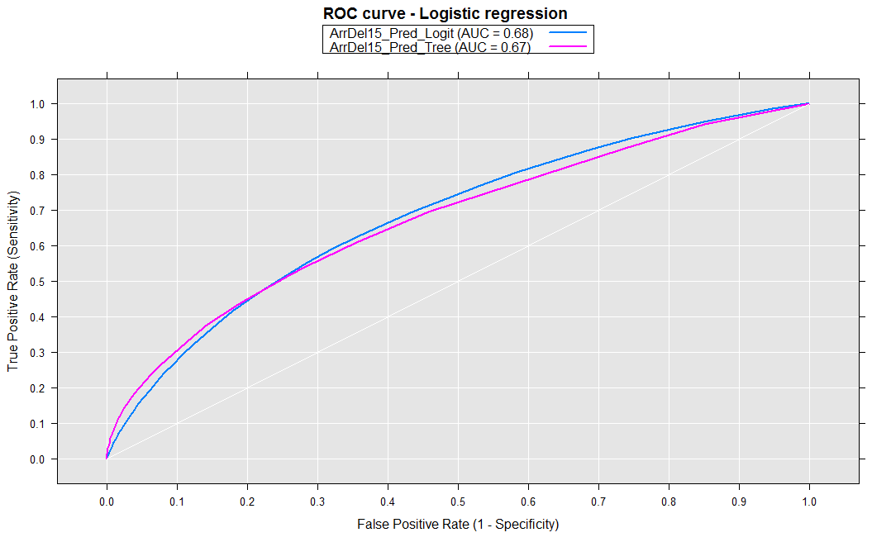
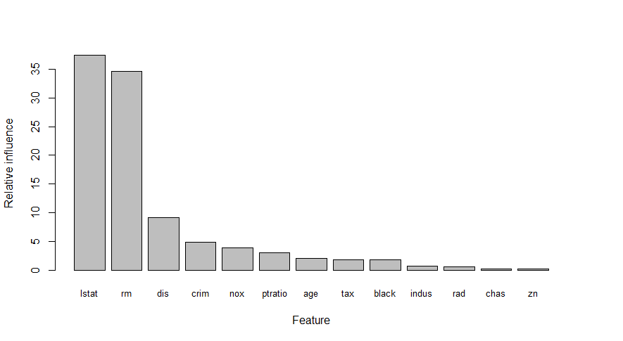
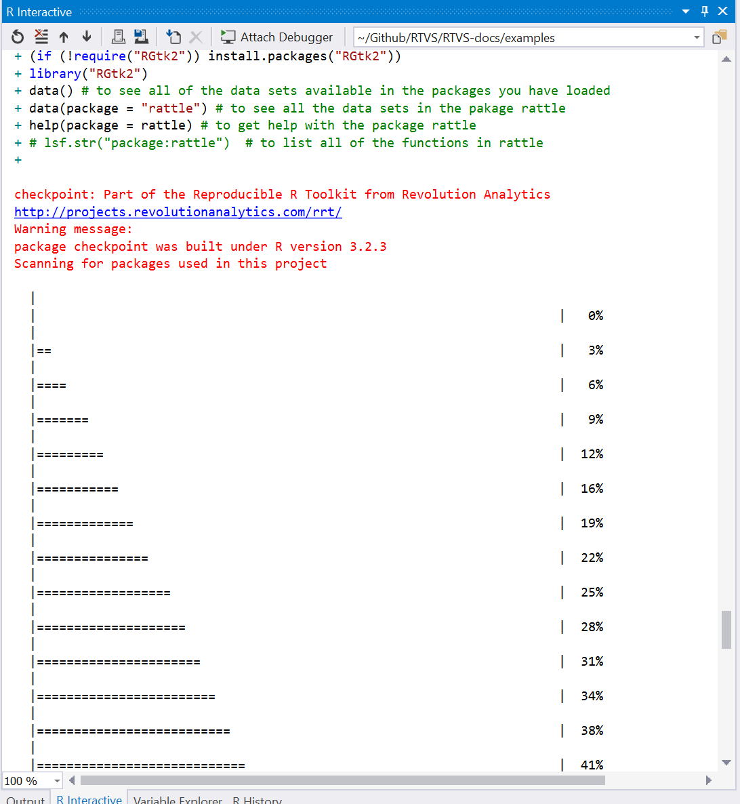
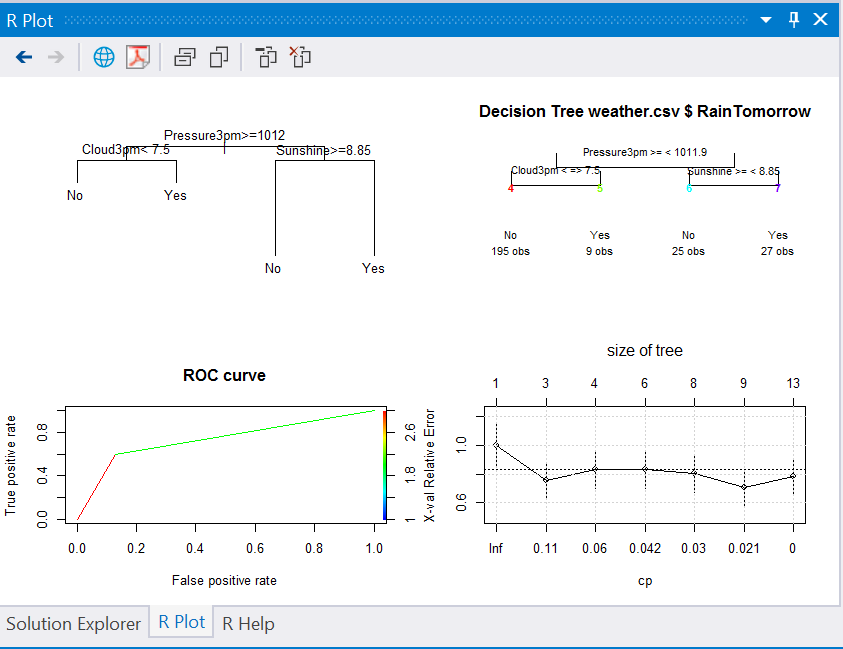
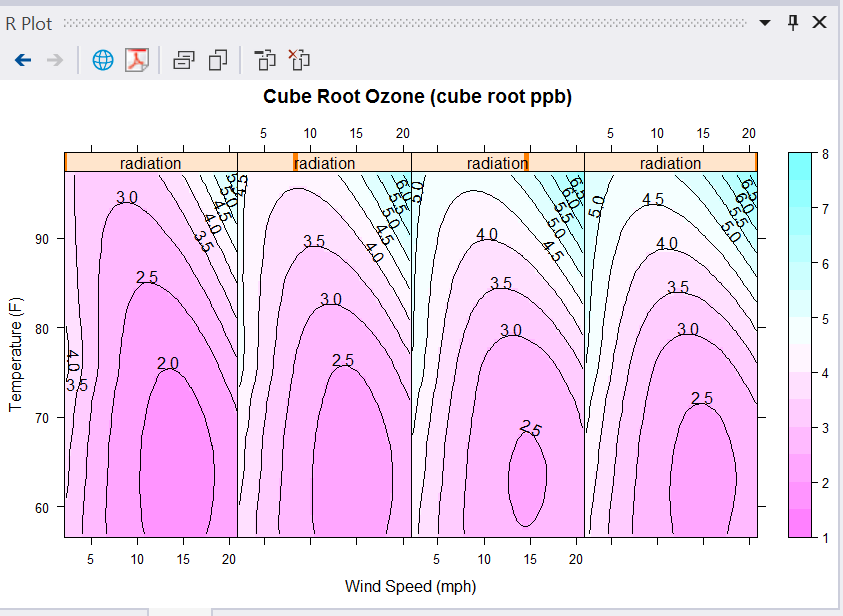
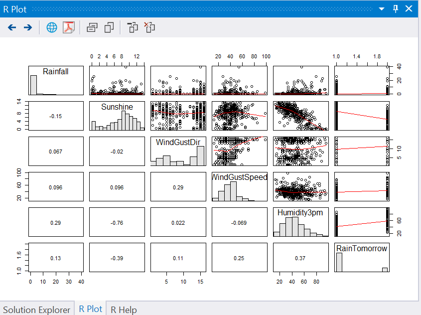

# Examples for how to use R Tools for Visual Studio

These examples will give you a running start using R Tools for Visual Studio.
There are examples that give you an introduction to R, examples on how to make
your code run fast, and examples on how to use Microsoft R Server for big
datasets on multi-core machines. Watch this 3-minute video to get a quick
overview of the examples:

<iframe width="560" height="315" src="https://www.youtube.com/embed/5Z30_Qpc8j0" frameborder="0" allowfullscreen></iframe>

## Downloading and launching the examples

1. [Download the examples](https://github.com/Microsoft/RTVS-docs/archive/master.zip).

1. Unzip the archive, and open the solution by double-clicking on the
   `examples\Examples.sln` file.

If you prefer to work with the examples via Github, they are all available in
the `master` branch of the [RTVS-docs repository on
Github](https://github.com/microsoft/rtvs-docs).

## Overview 

In the zip archive, there are a number of examples, grouped into different categories:

* Microsoft R Server 
* Microsoft R Open
* Machine Learning 
* Introduction to R

In the sections that follow, you'll find detailed abstracts for each example.

## Microsoft R Server 

These examples show off the power of [Microsoft R
Server](https://www.microsoft.com/en-us/server-cloud/products/r-server/), which
lets you work with datasets that are too large to fit in memory.

### rxGLM() benchmark

This example demonstrates the differences between CRAN R and R server.
Specifically, it shows how the difference in performance between rxGlm() and
glm(). The R server function rxGlm() fits a generalized linear model on data
that is potentially much larger than available RAM.

### Flight delay prediction

This example uses historical on-time performance and weather data to predict
whether the arrival of a scheduled passenger flight will be delayed by more than
15 minutes. It uses datasets from the Github repository for the examples. While
the datasets are relatively small for the purposes of illustration, in practice
you can scale those datasets to whatever size makes sense for your application.

### R and R Server comparison

The comparison of using R and R Server consists of three examples, each illustrating a slightly different aspect:

* R_MRO_MRS_Comparison_Part_1_Functions.R

  - Demonstrates how to do cluster analysis using `kmeans()` and `rxKmeans()`.
  - The sample creates some simulated data in two overlapping groups, then finds the cluster allocation and cluster centres.
  
    
  
* R_MRO_MRS_Comparison_Part_2_Capacity.R

  - This demonstrates the `rxKmeans()`, like all the `rx` functions, can handle much larger datasets than CRAN R functions.
  
* R_MRO_MRS_Comparison_Part_3_Speed.R

  - This compares the execution speed of clustering using `kmeans()` and `rxKmeans()`, demonstrating that for this algorithm there is no inherent performance benefit of using `rxKmeans()`, but `rxKmeans()` can handle much larger datasets.
  
    
  

### Bike rental estimation

This example demonstrates the Feature Engineering process for building a
regression model to predict bike rental demand using historical datasets.
Similar to the previous example, the datasets are relatively small (17,379 rows
and 17 columns) for the purposes of illustration, but can be scaled to whatever
size makes sense for your application.

## Microsoft R Open (R with MKL) 

These examples show off the power of [Microsoft R
Open](https://mran.revolutionanalytics.com/open/), Microsoft's distribution of R
which has two key differentiators over [CRAN R](https://cran.r-project.org/):

1. [Better computation
   performance](https://mran.revolutionanalytics.com/rro/#intelmkl1) when
   coupled with the [Intel Math Kernel
   Libraries](https://software.intel.com/en-us/intel-mkl) which are available as
   a free download from Microsoft for use with Microsoft R Open. 

1. [Reproducible R
   Toolkit](https://mran.revolutionanalytics.com/rro/#reproducibility), which
   ensures that the libraries that you built your R program with are always
   available to others that want to reproduce your work.

### Benchmarks

This example runs a number of compute-intensive benchmarks to show the
performance gains that are possible through the use of the Intel Math Kernel
Libraries in Microsoft R Open. This sample produces a box plot showing the
impact of running the same computation on multiple cores:

### Deploying an Azure Machine Learning web service

This example shows how you can create a linear regression model using R, and
then publish it as an Azure Web Service using an [Azure Machine
Learning](https://azure.microsoft.com/en-us/services/machine-learning/)
workspace.

## Introduction to R and Machine Learning

### Gradient Boosting Machine

This example uses a Gradient Boosting machine to create a model that predicts
[housing prices in the suburbs of
Boston](https://cran.r-project.org/web/packages/MASS/MASS.pdf) based on features
such as per-capita crime statistics, number of rooms per dwelling and the
property tax rate. Note that it takes quite some time to run this model, so
don't expect immediate results. If you find that it takes too long, there is a
commented out block of code that you can substitute that has a smaller parameter
tuning grid.

The output of this example is a plot of features showing the relative influence
of each one on the model:

## Introduction to R

If you are new to R, this set of examples is a great introduction to the
language and its packages. 

Note that these examples all use the `checkpoint` package to manage
dependencies. At the start of each script, the `checkpoint()` function scans the
project for dependencies and automatically installs them. This can take quite
some time the first time you run the script. However, the installation happens
only once. On subsequent script execution, the packages do not get re-installed.

Here are the topics that are covered:

1. Getting Started
1. A first look at R
1. Data structures
1. Functions
1. More functions
1. Data manipulation
1. Plots
1. Basic statistics
1. Data exploration
1. Clustering
1. Classification
1. Working with SQLite

Example output from these tutorial scripts:

