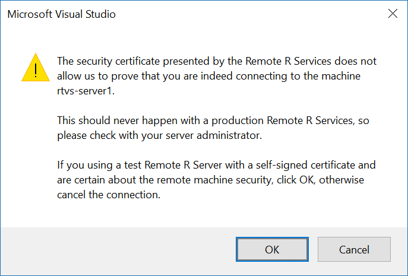
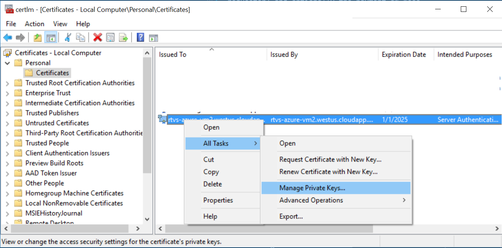
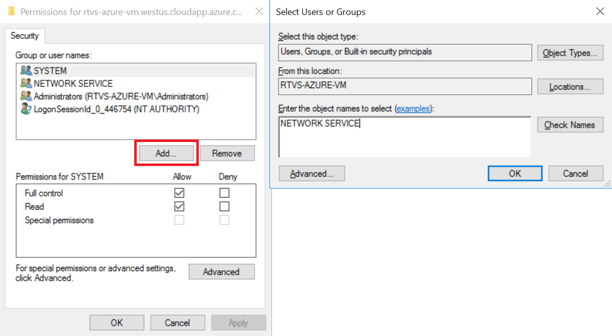
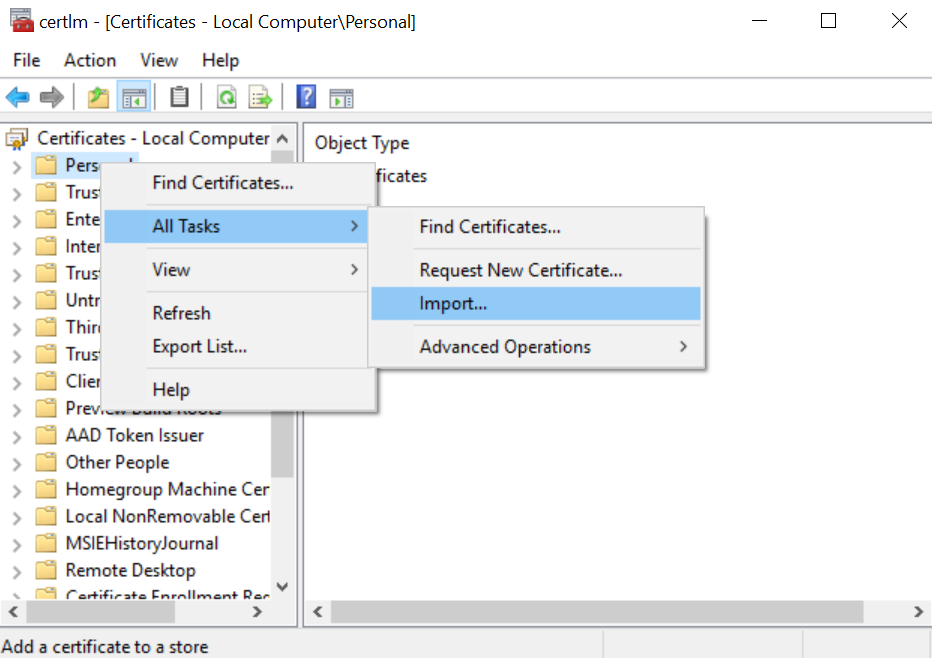

# Setting up a Remote Workspace

To setup a Remote Workspace, you will need to first start with a computer that
has the following software installed on it:

* Windows 10 or Windows Server 2012 R2 or Windows Server 2016
* [.NET Framework 4.6.1](https://www.microsoft.com/en-us/download/details.aspx?id=49981)
  or greater

## Installing the SSL certificate

All communications with the remote computer **must** be via the **https**
protocol. In order to encrypt communications between the client and the server,
you must install an SSL certificate on the server computer.

There are two types of certificates that you can create: a [self
signed](https://en.wikipedia.org/wiki/Self-signed_certificate) certificate, and
a [certificate signed by a trusted third
party](https://en.wikipedia.org/wiki/Public_key_certificate) (a [certificate
authority](https://en.wikipedia.org/wiki/Certificate_authority)). The former is
the equivalent of issuing your own ID card. The latter is the equivalent of
going to your government and obtaining an official ID card. The latter almost
always involves more process (to verify the authenticity of the request and the
requestor) and optionally the payment of fees.

### Obtaining a self-signed certificate

We provide instructions below on creating a self-signed certificate. If you
install a self-signed certificate on your R server, we will always show a
warning that tells your users that the certificate wasn't issued from a trusted
3rd party.



We present this warning because an attacker can substitute their own certificate
for the unsigned certificate and capture all of the traffic between the client
and the server. This is why self-signed certificate should only ever be used for
testing scenarios, on a trusted network, and never in production.

To issue a self-signed certificate, you will first need to log onto the R server
computer using an administrator account. Open a new administrator PowerShell
command prompt and issue the following command, replacing
`"remote-machine-name"` with the fully qualified domain name of your server
computer.

```
New-SelfSignedCertificate -CertStoreLocation Cert:\LocalMachine\My -DnsName "remote-machine-name"
```

If you have never run Powershell before on the R server computer, you will need to
run the following command to enable running of commands explicitly:

```
Set-ExecutionPolicy -ExecutionPolicy RemoteSigned
```

### Granting permissions to read the SSL certificate's private key

Now that the certificate has been created, you will need to grant the `NETWORK
SERVICE` account permission to read the certificate's private key. This is the
account that is used to run the R Services broker, which is the service that
terminates incoming SSL connections to the server computer. To do this, type
`certlm.msc` in your Powershell administrator command prompt.

1. Navigate to your certificate; you will find it under the
   `Personal\Certificates` folder
1. Right-click on the certificate and select the Manage Private Keys command
   under All Tasks



In the dialog that appears, click on the `Add` button and enter `NETWORK
SERVICE` as the account name that you want to grant access to the certificate's
private key.



Click `OK` to dismiss the two dialog boxes and commit your changes.

### Setting up a trusted certificate

You will need to work with your certificate authority to generate your trusted
certificate. The key field that needs to be in the certificate is the fully
qualified domain name of your R server computer. You will need to prove to your
certificate authority that you have the authority to create a new server for the
domain to which your server belongs to.

Once you have a certificate (which must also contain the private encryption key)
you can must install it on your computer. You can do so by opening the
certificate manager by typing `certlm.msc` from a command prompt. Right click on
the Personal folder, click on All Tasks, and run the Import command.



Navigate to where your certificate is stored on your computer, and import it
into the Personal store. Once you have done so, you will need to grant the
`NETWORK SERVICE` account permissions to read the private key from the
certificate. Follow the instructions in the section above on `Granting
permissions to read the SSL certificate's private key` to complete this step.

## Installing R Services

Now that you have your SSL certificate installed, and you have granted the NETWORK
SERVICE account access to its private key, you are now ready to install the R Services.

First, you will need to install an R interpreter on your R server computer. You can
choose from Microsoft R Open or CRAN R. Both have identical functionality, but
Microsoft R Open benefits from additional hardware accelerated linear algebra 
libraries courtesy of the [Intel Math Kernel Library](https://software.intel.com/en-us/intel-mkl).

You can download R from one of the links below:

* [Microsoft R Open](https://mran.microsoft.com/open/)
* [CRAN R for Windows](https://cran.r-project.org/bin/windows/base/)

Once you have completed installing R on the R server computer, you can install the
R components. 

* Run the [R Services installer](https://aka.ms/rtvs-services).

When the installer is complete, it will ask you to reboot the machine. Once the
machine has completed rebooting, the R services will automatically start. You can 
see the services using the Services management console snap-in. Launch it from
an administrator command prompt using `compmgmt.msc`:


As you can see, there are two services running. The `R Host Broker Service` is
the component that handles all HTTPS traffic between Visual Studio and process
where the R code runs on the machine. The `R User Profile Service` is a
privileged component that handles Windows user profile creation. This is called
when a new user first logs onto the R server machine.

## Configuring R Services

### User accounts

Now that you have installed R services on the machine, you'll need to create
some user accounts for your users. You can either create standard
(non-privileged) local user accounts for your users, or you can join your R
server machine to your domain and add the appropriate security groups to the
`Users` security group on your R server.

### Firewall rules

By default, the `R Host Broker` listens on TCP port 5444. Therefore, you must
ensure that there are Windows firewall rules enabled that will let traffic in
(and enable outbound traffic as well for scenarios like installing packages).
The installer for R services will do this automatically for you. However, if you
are using 3rd party firewall software, you will need to configure it to allow R
Host Broker traffic to pass through. 

### Azure configuration

Azure networking also implements its own firewall that is independently
configured from the Windows firewall. You will need to make sure that you have
the appropriate set of rules in place to allow incoming traffic through. You
will need to configure an [Azure network security
group](https://docs.microsoft.com/en-us/azure/virtual-network/virtual-networks-nsg)
and add a new inbound security rule that lets TCP traffic on port 5444 pass.

### Configuring your SSL certificate

You will need to tell the R Host Broker which SSL certificate to load when it
starts up. If you are installing the certificate on an Intranet server, it is
likely that the fully qualified domain name of your server is the same as its
NETBIOS name. In this case there is nothing that you need to do, as this is the
default certificate that is loaded.

However, if you are installing your certificate on an Internet facing server (as
would be the case for a server that is hosted by Azure), you will need to
configure the R Host Broker to load the certificate with the Fully Qualified
Domain Name (FQDN) of your server. This is because the FQDN of an
Internet-facing server will never be the same as its NETBIOS name.

To do this, you must first open an Administrative Command Prompt and navigate to
where R Services is installed. By default, it is installed in `%PROGRAM FILES%\R
Remote Service for Visual Studio\1.0`. Once there, you need to open the
`Microsoft.R.Host.Broker.Config.json` file using a text editor. Replace the
contents of the file with the following; make sure that you assign CN to 
whatever the FQDN of your server is (e.g., `foo.westus.cloudapp.azure.com`)

```
{
  "server.urls": "https://0.0.0.0:5444",
  "security": {
    "X509CertificateName": "CN=your-server-fully-qualified-domain-name"
  }
}
```

You will need to restart your computer to see this change take effect.

## Troubleshooting

**Q. The R server machine is not responding, what do I do?**

Check if you can ping the remote machine from the command line: `ping
remote-machine-name` If the ping fails make sure the machine is running.

**Q. The R interactive window says the remote machine is on, but service is not
running?**

There are three possible reasons for this:

*	`.Net 4.6.1` or greater was not installed on the remote machine. Check for that.
*	Ensure that the firewall rules for `Microsoft.R.Host.Broker` and
 	`Microsoft.R.Host` are enabled for both incoming and outgoing connections.
*	SSL certificate with `CN=<remote-machine-name>` was not installed

Restart the OS after doing any of the above changes. Make sure that
`RHostBrokerService` and `RUserPofileService` are running, from either Task
Manager (services tab) or `services.msc`.

**Q. Why does the R interactive window say `401 Access denied` while connecting to the R
server?**

There are two possible reasons:

*	It is highly likely that the `NETWORK SERVICE` account does not have access to
 	the private key of the SSL certificate. Follow the instructions above to grant
 	the `NETWORK SERVICE` access to the private key.
*	Make sure that `seclogon` service is running. Use `services.msc` to configure
 	`seclogon` to start automatically.                                                         

**Q. Why does the R interactive window say `404 Not found` while connecting to the R
server?**

This is probably due to missing Visual C++ redistributable libraries. Check the
R interactive window to see if there is a message regarding missing library(DLL).

*	Check to make sure vc 2015 redistributable is installed. 
*	Make sure that you have installed R as well. 

**Q. Cannot access internet/resource from the R interactive window, what do I
do?**

Ensure that the firewall rules for `Microsoft.R.Host.Broker` and
`Microsoft.R.Host` allow outbound access. Restart the OS after applying these
changes.

**Q. I've tried all the above, and it still doesn't work now what?**

* Look in the log files. They can be found here:
  `C:\Windows\ServiceProfiles\NetworkService\AppData\Local\Temp`. You will find
  a separate log file for each instance of the R Broker Service that was run. In
  other words, if the service had to restart for any reason, a new log file will
  be created. You will likely want to look at the one with the most recent 
  timestamp for clues about what might be going wrong.

**Q. What are the things the Remote RTVS installer do?**

*	Creates a folder in `%PROGRAMFILES%\R Tools for Visual Studio\1.0\` and copy
 	all the required binaries.
*	Installs `RHostBrokerService` and `RUserProfileService`, and configures them to
 	start automatically.
*	Configures `seclogon` service to start automatically.
*	Adds `Microsoft.R.Host.exe` and `Microsoft.R.Host.Broker.exe` to the firewall
 	inbound rules. Note that the default port that the `R Host Broker` listens on
 	is 5444.

