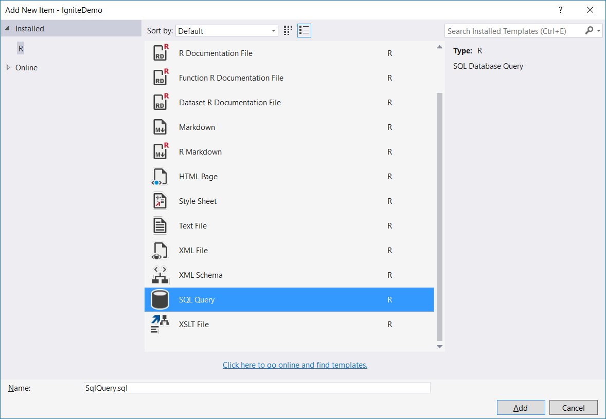
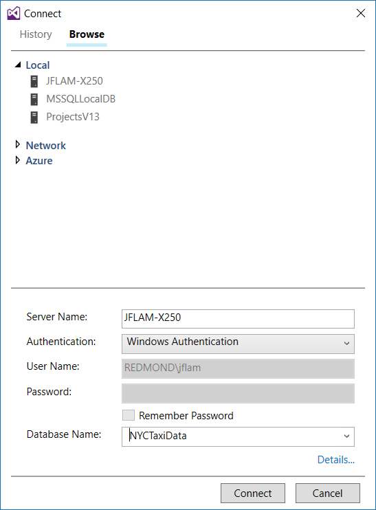

# SQL Server Integration

SQL databases are a major source of data for data scientists. RTVS makes it
easier to work with SQL data by integrating with the excellent support for SQL
Server that comes with Visual Studio.

## Support for SQL Queries

SQL statements are typically written interactively, by gradually refining the
query until the correct results are returned. To make it easier to work with SQL
Server, RTVS lets you add SQL queries to your existing projects. You can easily
do this by right-clicking on your project in Solution Explorer, and selecting
SQL Query from the Add New Item command. This creates a file that will contain
the SQL query that you will create.

The file is opened in an editor window that lets you compose your SQL query.
Here's a SQL editor window with a query entered already:

Before the editor can provide you with IntelliSense, or execute your query, you
must first tell the editor what database to connect that window to. You can do
this by clicking on the Connect button in the toolbar window, or by attempting
to execute your query. Queries can be executed by pressing CTRL+SHIFT+E to run
the entire file, or by selecting a range of text and pressing CTRL+SHIFT+E.

If the SQL editor needs to establish a connection to the database, it will pop
up this dialog:

In the dialog, you must choose the Server and the Database on that server that
you want to connect to. Clicking on the Connect button will either establish a
connection to the server, or report any errors that were encountered. Once a
connection has been established, you can see the results of your query, as well
as get full IntelliSense for elements within your query (e.g., table names or
column names if you have specified the table name already in your query).

For more details on how to use the Transact-SQL editor to compose your SQL
queries, see the [Transact-SQL Editor Documentation on
MSDN](https://msdn.microsoft.com/en-us/library/hh272706(v=vs.103).aspx)

